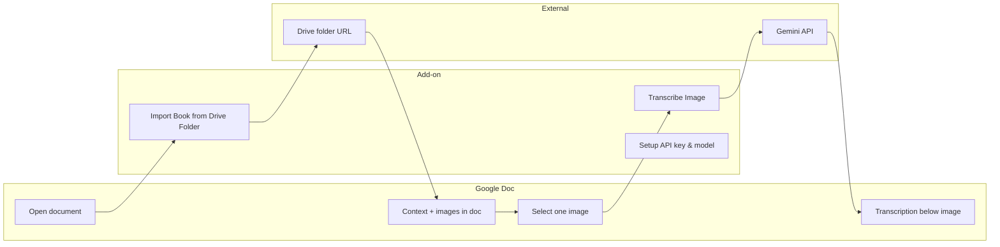

# 📖 Metric Book Transcriber Add-On

A Google Docs add-on that helps transcribe images of metric books (birth, marriage, and death registers) using the **Google AI (Gemini)** API. You can **import scan images from a Google Drive folder** into a document (with a Context block and source links), then **transcribe** selected images; the add-on inserts a structured transcription **directly below the selected image** with readable formatting (bold labels, language summaries as bullets, Quality Metrics and Assessment highlighted in color).

## 🎬 Demo

[▶️ Watch a 2-minute demo of Import and Transcribe](https://www.youtube.com/watch?v=Hi8Hu1osihg)

## 📥 Install

**Recommended:** Install from the [Google Workspace Marketplace](https://workspace.google.com/marketplace/) (search for "Metric Book Transcriber"). One click, works in any Google Doc. See [Installation](docs/INSTALLATION.md) for all options (Marketplace, test deployment, container-bound, or clasp).

## 📸 Sample Output

## 📊 Overview

*Typical flow: import from Drive (or add context and images manually), then transcribe selected images one by one.*

- **📍 Where it runs:** Google Docs (install from the [Marketplace](https://workspace.google.com/marketplace/), or use a Test deployment / container-bound script).
- **📁 Import from Drive:** **Extensions → Metric Book Transcriber → Import Book from Drive Folder** prompts for a Drive folder URL or ID, then adds a **Context** section at the top (full sample template from `ContextTemplate.gs` with bold labels), imports up to **30 images** from the folder (JPEG, PNG, WebP only), natural-sorted by filename. For each image: a **Heading 2** with the image name (no extension), a **Source Image Link** line (link to the file in Drive), the image (scaled to content width), and a page break. Very large or invalid images are skipped and the final alert reports how many were added or skipped.
- **✍️ Transcribe:** Select an image in the document and run **Transcribe Image**. The add-on sends that image plus the document's Context to the **Gemini** API and inserts the structured transcription under the image. Output includes page header metadata, per-record fields, language summaries (Russian, Ukrainian, Latin, English), and Quality Metrics / Assessment (styled in blue and red).
- **🔑 API key & model:** A Google AI (Gemini) API key is required. The add-on prompts you to enter it the first time you run **Transcribe Image** (with a link to [Google AI Studio](https://aistudio.google.com/app/apikey)). You can choose the model: **Gemini Flash Latest** (default, free tier ~20 requests/day), **Gemini 3.1 Flash Lite** (500 requests/day), or **Gemini 3.1 Pro Preview** (best quality, billing). Update key or model anytime via **Extensions → Metric Book Transcriber → Setup API key & model**. See [rate limits](https://aistudio.google.com/rate-limit) for free tier and billing. Each user's key and model choice are stored privately (User Properties). Drive folder import requires access to the folder (you own it or it's shared with you).

## 📚 Documentation

- **[📘 User Guide](docs/USER_GUIDE.md)** — Import from Drive, document structure (Context + images), how to transcribe step-by-step, output format, tips, and troubleshooting.
- **[⚙️ Installation](docs/INSTALLATION.md)** — Marketplace install (recommended), test deployment, container-bound, or clasp.
- **[🔒 Privacy Policy](docs/PRIVACY_POLICY.md)** — What data the add-on accesses and how it is handled.
- **[📄 Terms of Service](docs/TERMS_OF_SERVICE.md)**

## 📂 Repo layout

- **`addon/`** — Apps Script source: `Code.gs`, `ContextTemplate.gs`, `Prompt.gs`, `appsscript.json`.
- **`docs/`** — User guide, installation, design, privacy policy, terms of service, store listing copy.
- **`project/`** — Specs (SPEC.md, SPEC-1-POC, SPEC-2-GDRIVE-to-GDOC, SPEC-3-APIKEY-SETUP, SPEC-4-PUBLISH-MARKETPLACE).
