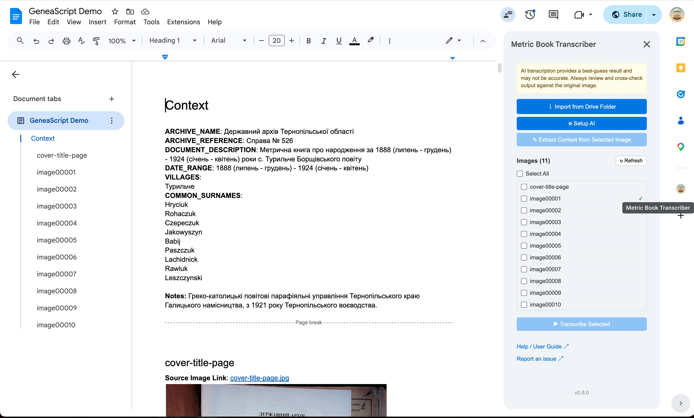
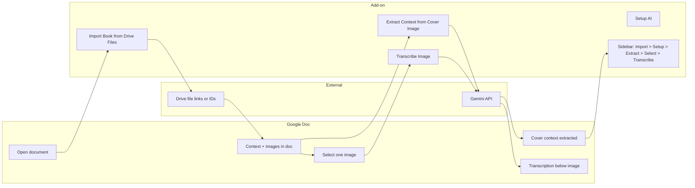

# 📖 Metric Book Transcriber Add-On

A Google Docs add-on that helps transcribe images of metric books (birth, marriage, and death registers) using the **Google AI (Gemini)** API. You can **import scan images from selected Google Drive files** into a document (with a Context block and source links), then **transcribe** one image at a time from the menu or **batch-transcribe** multiple images from the **sidebar**; the add-on inserts structured transcription **directly below each image** with readable formatting (bold labels, language summaries as bullets, Quality Metrics and Assessment highlighted in color).

## 🎬 Demo

[▶️ Watch a 2-minute demo of Import and Transcribe](https://www.youtube.com/watch?v=Hi8Hu1osihg)

## 📥 Install

**Recommended:** Install from the [Google Workspace Marketplace](https://workspace.google.com/marketplace/) (search for "Metric Book Transcriber"). One click, works in any Google Doc. See [Installation](docs/INSTALLATION.md) for all options (Marketplace, test deployment, container-bound, or clasp).

## 📸 Current UI (v0.8)

## 📊 Overview

*Typical flow: import from Drive, setup AI, extract context from cover image, then transcribe selected images.*

- **📍 Where it runs:** Google Docs (install from the [Marketplace](https://workspace.google.com/marketplace/), or use a Test deployment / container-bound script).
- **📁 Import from Drive:** **Extensions → Metric Book Transcriber → Import Book from Drive Files** prompts for Drive file links or IDs, then adds a **Context** section at the top (full sample template from `ContextTemplate.gs` with bold labels), imports up to **30 selected images** (JPEG, PNG, WebP only), natural-sorted by filename. For each image: a **Heading 2** with the image name (no extension), a **Source Image Link** line (link to the file in Drive), the image (scaled to content width), and a page break. Inaccessible, unsupported, very large, or invalid images are skipped and the final alert reports how many were added or skipped.
- **✍️ Transcribe:** Select an image in the document and run **Transcribe Image**. The add-on sends that image plus the document's Context to the **Gemini** API and inserts the structured transcription under the image. Output includes page header metadata, per-record fields, language summaries (Russian, Ukrainian, Latin, English), and Quality Metrics / Assessment (styled in blue and red).
- **🔑 API key, model, and request config:** A Google AI (Gemini) API key is required. The add-on prompts you to enter it the first time you run **Transcribe Image** (with a link to [Google AI Studio API Keys](https://aistudio.google.com/api-keys)). You can choose the model: **Gemini Flash Latest** (default, free tier ~20 requests/day), **Gemini 3.1 Flash Lite** (500 requests/day), or **Gemini 3.1 Pro Preview** (best quality, billing). In the same setup dialog you can tune transcription behavior using **Transcription strictness**, **Max text length**, **Reasoning depth**, and (when supported) **Reasoning effort limit**, each with inline impact hints. Update key/model/settings anytime via **Extensions → Metric Book Transcriber → Setup AI**. See [Gemini API pricing](https://ai.google.dev/gemini-api/docs/pricing) for cost details by model and token usage. Each user's key, model, and request settings are stored privately (User Properties). Drive import requires access to each selected file (you own it or it is shared with you).

## 📚 Documentation

- **[📘 User Guide](docs/USER_GUIDE.md)** — Import from Drive, document structure (Context + images), how to transcribe step-by-step, output format, tips, and troubleshooting.
- **[⚙️ Installation](docs/INSTALLATION.md)** — Marketplace install (recommended), test deployment, container-bound, or clasp.
- **[🔒 Privacy Policy](docs/PRIVACY_POLICY.md)** — What data the add-on accesses and how it is handled.
- **[📄 Terms of Service](docs/TERMS_OF_SERVICE.md)**
- **[📈 Observability Setup](observability/README.md)** — Complete metrics catalog, dashboard architecture, provisioning flow, and Google Cloud apply/verify steps.

## 📂 Repo layout

- **`addon/`** — Apps Script source: `Code.gs`, `ContextTemplate.gs`, `Prompt.gs`, `appsscript.json`.
- **`docs/`** — User guide, installation, design, privacy policy, terms of service, store listing copy.
- **`observability/`** — Dashboard config, metric apply script, and setup guide for Google Cloud Monitoring/Logging.
- **`project/`** — Specs (SPEC.md, SPEC-1–6) and [`TEMPLATE-SPEC.md`](project/TEMPLATE-SPEC.md) for new features. Cursor SDD workflow: `.cursor/rules/spec-driven-workflow.mdc`.
