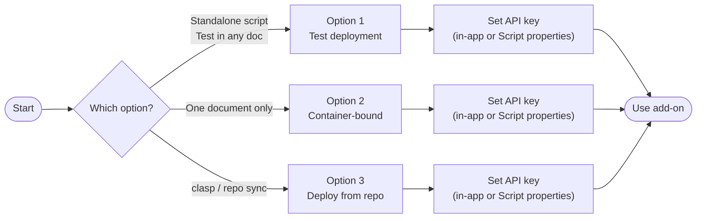
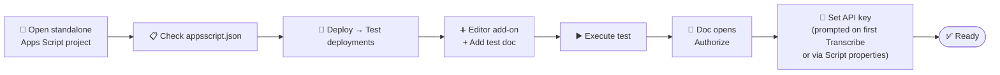
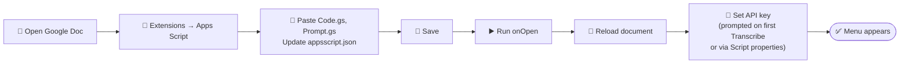
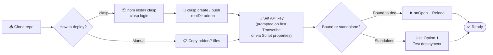

# ⚙️ Installation — Metric Book Transcriber Add-On

This add-on runs in Google Docs and uses the **Google AI (Gemini)** API to transcribe metric book images. Choose one of the installation options below. The API key can be entered the first time you run **Transcribe Image** (the add-on will prompt you), or set manually in Script properties.

## 🗺️ Choose your installation path

| Path | Best for |
|------|----------|
| **Option 1** | Standalone Apps Script project; run in any doc via **Test deployments** (Editor add-on). |
| **Option 2** | One Google Doc; script lives inside that document (**Extensions → Apps Script**). |
| **Option 3** | Using **clasp** or copying from repo; then follow Option 1 or 2 depending on project type. |

---

## ✅ Prerequisites

- **📧** A Google account (personal or Google Workspace).
- **📄** A Google Document where you want to transcribe metric book images.
- **🔑** A **Google AI API key** (Gemini). Get one at [Google AI Studio](https://aistudio.google.com/app/apikey) or [Google Cloud Console](https://console.cloud.google.com/) (enable the Generative Language API and create an API key). You can skip this step — the add-on will prompt you with instructions and a link on first use of **Transcribe Image**.

---

## 1️⃣ Option 1: Add-on deployment (standalone project)

Use this option if your script lives in a **standalone** Apps Script project (e.g. created at [script.google.com](https://script.google.com)). You run it in the context of a document via **Test deployments**.

**⚠️ Important:** Test deployments must use the **Editor add-on** type and have a **test document** selected. Without this, the add-on menu will not appear in the document.

1. **📂 Open your standalone project** in the Apps Script editor.
2. **📋** Ensure `appsscript.json` matches the repo (no `addOns` block; includes `script.container.ui` scope). See `addon/appsscript.json`.
3. **🚀 Create a test deployment:**
   - **Deploy** → **Test deployments**.
   - Under **Select type**, choose **Editor add-on** (not "Google Workspace add-on").
   - In **Configuration**, click **+ Add test**.
   - Select your **test document** (the Google Doc you will use; create one if needed).
   - Set **Version** to **Latest code** (and **Enabled** as needed).
   - Save. (See `docs/TestDeployments_popup.jpg` for reference if available.)
4. **▶️ Run the test:** In the Test deployments dialog, select your saved test and click **Execute**. The test document opens with the add-on available.
5. **📄** In the document you should see the **Metric Book Transcriber** menu (e.g. **Extensions** → **Metric Book Transcriber** → **Transcribe Image**). Authorize when prompted.
6. **🔑** Set the API key. You have two options:
   - **In-app (recommended):** Just run **Transcribe Image** — if no key is set, a dialog appears with instructions and a link to [Google AI Studio](https://aistudio.google.com/app/apikey). Enter the key and click **Save & Continue**.
   - **Manual:** **Project Settings** → **Script properties** → add `GEMINI_API_KEY` with your key. (Note: the in-app dialog stores the key per user; manual Script properties are shared across all users of the project.)

The add-on runs in the context of the test document. When you run **Transcribe Image**, a dialog shows "Awaiting response from Gemini API… This may take up to 1 minute." To test with the latest code, keep **Latest code** in the test and refresh the document after saving changes.

---

## 2️⃣ Option 2: Add script to document (container-bound)

Use this option to attach the add-on directly to **one document**. The script is **bound** to that document.

1. **📄 Open the Google Document** you use for metric books (or create a new one).
2. **🔌** **Extensions** → **Apps Script**. This opens the script editor bound to this document.
3. **📝 Replace the default script** with the add-on code:
   - Delete the default `Code.gs` content and paste the contents of `addon/Code.gs` from this repo.
   - Add a file **Prompt.gs** and paste the contents of `addon/Prompt.gs`.
   - **Project Settings** (gear) → enable **Show "appsscript.json" manifest file in editor**, then open `appsscript.json` and replace its contents with `addon/appsscript.json` from this repo.
4. **💾 Save** the project (Ctrl+S / Cmd+S).
5. **▶️** Run **onOpen** once from the script editor (authorize if prompted). **🔄 Reload** the document; the menu **Extensions** → **Metric Book Transcriber** → **Transcribe Image** should appear.
6. **🔑** Set the API key: run **Transcribe Image** and the add-on will prompt you with instructions and a link to [Google AI Studio](https://aistudio.google.com/app/apikey). Alternatively, set it manually in **Project Settings** → **Script properties** (note: the in-app dialog stores the key per user; manual Script properties are shared).

---

## 3️⃣ Option 3: Deploy from repo (clasp or manual)

Use this option if you use [clasp](https://github.com/google/clasp) or want to keep the add-on in sync with this repository.

1. **📥** Clone this repo and `cd` into it.
2. **With clasp:**  
   - `npm install -g @google/clasp`  
   - `clasp login`  
   - Create a new Apps Script project: `clasp create --type docs --title "Metric Book Transcriber" --rootDir addon` (or clone an existing project and set `rootDir` to `addon`).  
   - `clasp push --rootDir addon`.
3. **Without clasp:** Copy the contents of `addon/Code.gs`, `addon/Prompt.gs`, and `addon/appsscript.json` into your Apps Script project (create one from a document via **Extensions** → **Apps Script**, or create a standalone at script.google.com).
4. **🔑** Set the API key: run **Transcribe Image** in the document and the add-on will prompt you, or set it manually in **Project Settings** → **Script properties** (note: the in-app dialog stores the key per user; manual Script properties are shared).
5. If the script is **bound to a document**, run **onOpen** once and reload the doc. If it is **standalone**, use **Option 1** (Test deployments) to run it in a document.

---

## 🖼️ Add-on logo

The current manifest has no `addOns` block (the add-on is used as an Editor add-on via Test deployments). To use a logo in the Extensions menu you would add an `addOns` block; `logoUrl` must be a **public HTTPS URL**. A 1000×1000 px image is suitable (Google scales it). See `addon/img/README.md` for details and optional logo setup.

## 🔑 API key and security

- The API key is stored in **User Properties** (private to each Google account), not in the code. Each user's key is isolated — other users of the same script cannot see or use it.
- On first use of **Transcribe Image**, if no key is set, the add-on shows a dialog with instructions and a link to [Google AI Studio](https://aistudio.google.com/app/apikey) where you can get a free key. After entering the key and clicking **Save & Continue**, it is saved and the transcription proceeds.
- To rotate the key: run **Transcribe Image**, delete the old key in the dialog, and enter a new one. (Or clear it via `PropertiesService.getUserProperties().deleteProperty('GEMINI_API_KEY')` in the script editor console.)

## 🔧 Troubleshooting

| Issue | What to do |
|-------|------------|
| **Menu doesn't appear** | Reload the document. For container-bound scripts, ensure the script is bound to this document (Extensions → Apps Script opens the same project). For test deployments, run **Execute** from Deploy → Test deployments. |
| **"Please set your Google AI API key"** | Run **Transcribe Image** — the add-on will prompt you to enter a key with a link to [Google AI Studio](https://aistudio.google.com/app/apikey). The key is stored privately per user in User Properties. |
| **API errors / 403** | Confirm the API key is valid and the Generative Language API is enabled. Check [Google AI Studio](https://aistudio.google.com/app/apikey) or Cloud Console. |
| **Timeout** | The script uses a 60-second timeout. Try a smaller image or try again. |

For usage (document structure, Context section, step-by-step with screenshots), see [USER_GUIDE.md](USER_GUIDE.md).
