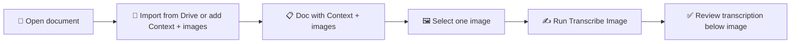
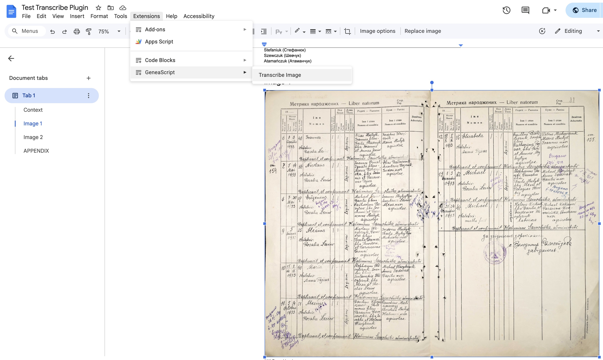
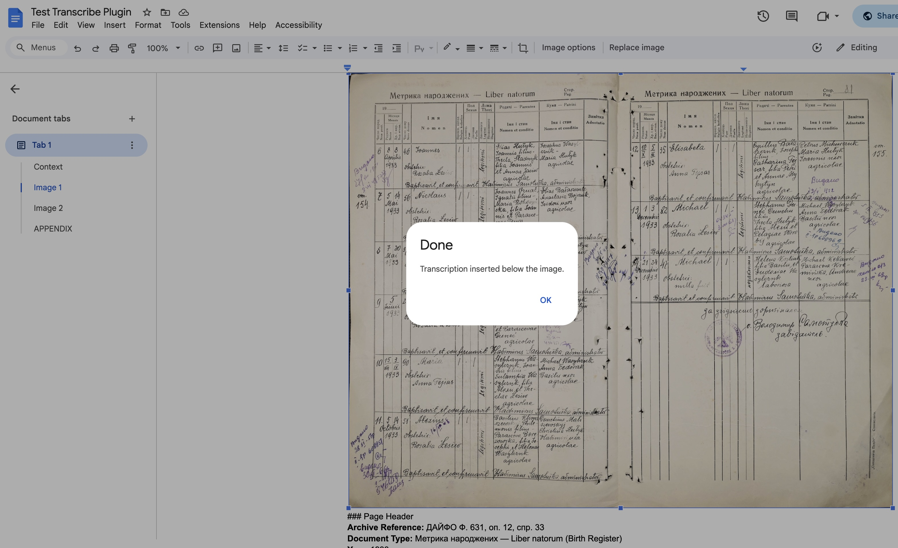
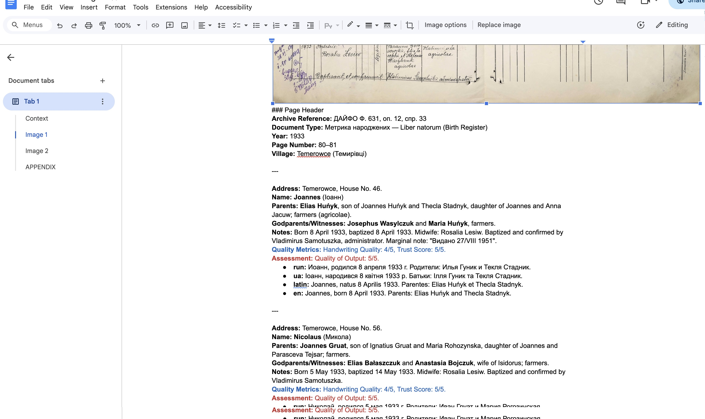

# 📖 User Guide — Metric Book Transcriber Add-On

This add-on helps you transcribe images of metric books (birth, marriage, death registers) using **Google AI (Gemini)**. You can **import scan images from a Google Drive folder** into a document (with a Context block and source links), then **transcribe** selected images; the add-on inserts the transcription **directly below the selected image** with clear formatting.

## 📊 User flow (left → right)

Repeat **Select image** → **Transcribe** for each page you want to transcribe.

## 🔄 Workflow summary

1. **Build the document** — Use **Import Book from Drive Folder** (recommended) or add Context and images manually.
2. **Transcribe** — Select one image at a time and run **Transcribe Image**.

---

## 📁 Import Book from Drive Folder (recommended)

Use this to create a document with a Context section and all scan images from a folder in one go.

1. Open a **new or existing** Google Doc.
2. Go to **Extensions** → **Metric Book Transcriber** → **Import Book from Drive Folder**.
3. When prompted, paste the **Google Drive folder URL or folder ID** that contains your metric book scans. You can copy the URL from the address bar when the folder is open in Drive (e.g. `https://drive.google.com/drive/folders/...`).
4. Click **OK**. The add-on will:
   - Add a **Context** section at the top (full sample template with bold labels: archive name, reference, villages, common surnames, etc. — you can edit it).
   - Import **up to 30 images** from the folder (**JPEG, PNG, WebP** only), **natural-sorted** by filename (e.g. page_2 before page_10).
   - For each image: a **Heading 2** with the image name (no extension), a **Source Image Link** line (clickable link to the file in Drive), then the image (scaled to content width), then a page break.
5. When the import finishes, you'll see how many images were added (and how many skipped, if any). You can now run **Transcribe Image** on any of them (see below).

**📌 Notes:** The folder must be one you own or that's shared with you. Very large or invalid images may be skipped; the add-on reports how many were skipped. Edit the Context block with your actual archive and locality details before transcribing for best results.

---

## 📄 Document structure (if you build the doc manually)

1. **📋 Context section** (required for best results)  
   Add a section titled **Context** near the top of the document. Under it, put any information that helps identify the record, for example:
   - Archive reference (e.g. fond, opis, case)
   - Document description (type of register, parish, locality)
   - Date range of the records
   - Village names
   - Common surnames in the area  

   The add-on sends all text under the heading “Context” to the model. Use plain text or short lines; no special format is required.

2. **🖼️ Images**  
   Below the Context section, insert your metric book images (scans) as usual in Google Docs (Insert → Image → Upload or paste). One image per “page” of the register is typical. You can have multiple images in one document.

## ✍️ How to transcribe an image

1. **🖼️ Click on the image** you want to transcribe so it is selected (handles appear around it).
2. Open **Extensions** → **Metric Book Transcriber** → **Transcribe Image**.

   

3. A dialog appears: **“Awaiting response from Gemini API… This may take up to 1 minute.”** Leave it open until the request finishes (the status bar may show “Working…”).
4. When the add-on finishes, the dialog closes and you see **“Done — Transcription inserted below the image.”** The transcription is inserted **directly under the selected image** (not at the end of the document).

   

5. **✅ Review and edit** the result in the document. **Quality Metrics** and **Assessment** lines are colored (blue and red) so they stand out from the historical data.

   

## 📝 What the output looks like

The transcription includes:

- **📌 Page header** — Year, page number, archival references, village names if visible.
- **📋 Per record** — For each birth, marriage, or death on the page (as **standard paragraphs**, not bullets):
  - **Address** (village, house number).
  - **Name(s)** — main person(s), then parents, godparents (births) or witnesses (marriages).
  - **Notes** — extra details from the record.
- **🔵 Quality Metrics** (shown in **blue**) — e.g. Handwriting quality (3/5), Trust score (4/5).
- **🔴 Assessment** (shown in **red**) — e.g. Quality of output (2/5), correction notes.
- **🌐 Language summaries** (as a **bulleted list**) — Russian, Ukrainian, Latin (original), English.

Blank lines separate records for readability. You can edit any of this text in the document.

## 💡 Tips

- **📋 Context:** The more precise the context (archive, dates, villages, surnames), the better the transcription and name normalization.
- **🖼️ Image quality:** Clear, upright scans work best. Cropping to the relevant table or page helps.
- **1️⃣ One image at a time:** Select exactly one image before running “Transcribe Image.” For another image, select it and run the add-on again.

## 🔧 Troubleshooting

| Issue | What to do |
|-------|------------|
| **“Please select a single image”** | Click on one metric book image so it is selected, then run **Transcribe Image** again. |
| **Invalid Drive Folder link** | Paste the full folder URL from the Drive address bar (e.g. `https://drive.google.com/drive/folders/...`) or the folder ID. Use a **folder** link, not a file. |
| **Cannot access folder** | The folder must be owned by you or shared with you. If you added Drive access recently, re-authorize (revoke the app in Google Account → Third-party apps, then run Import again). |
| **No images found in this folder** | Only JPEG, PNG, and WebP are imported. Add at least one image in one of these formats. |
| **Some images skipped** | Very large or invalid images may be skipped; the add-on reports how many. Resize or re-export large scans if needed. |
| **“Please set your Google AI API key”** | In the script editor: **Project Settings** → **Script properties** → add `GEMINI_API_KEY` with your key. See [INSTALLATION.md](INSTALLATION.md). |
| **Request failed / API error** | Check that your API key is valid and that the Generative Language API is enabled. If you see a quota or billing message, check your Google AI or Cloud project settings. |
| **Timeout** | The add-on waits up to about 60 seconds. If the request times out, try again or use a smaller/simpler image. |
| **Empty or odd transcription** | Ensure the selected element is the image (not a drawing or text). Add or improve the Context section and try again. |
| **Transcription at bottom of doc** | Ensure you have the latest script; insertion uses the body-level block containing the selected image. Select the image and run again. |

For installation and API key setup, see [INSTALLATION.md](INSTALLATION.md).
