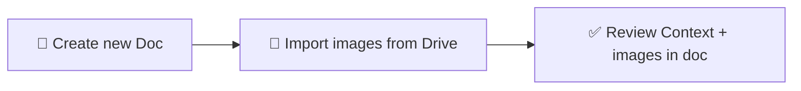
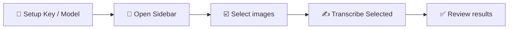
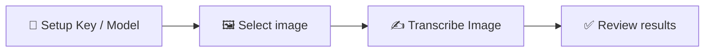
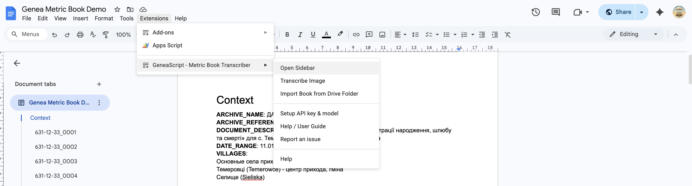
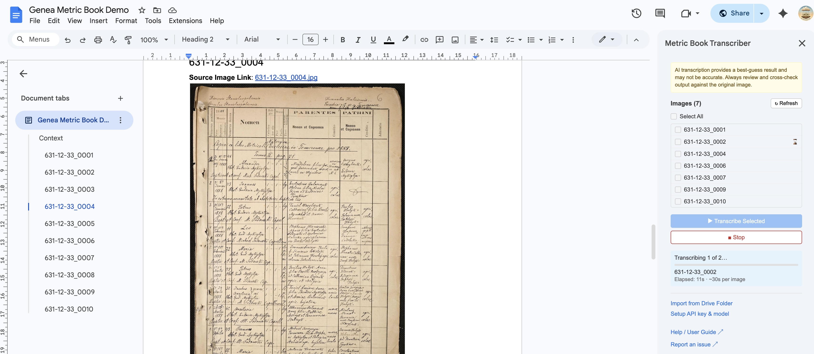
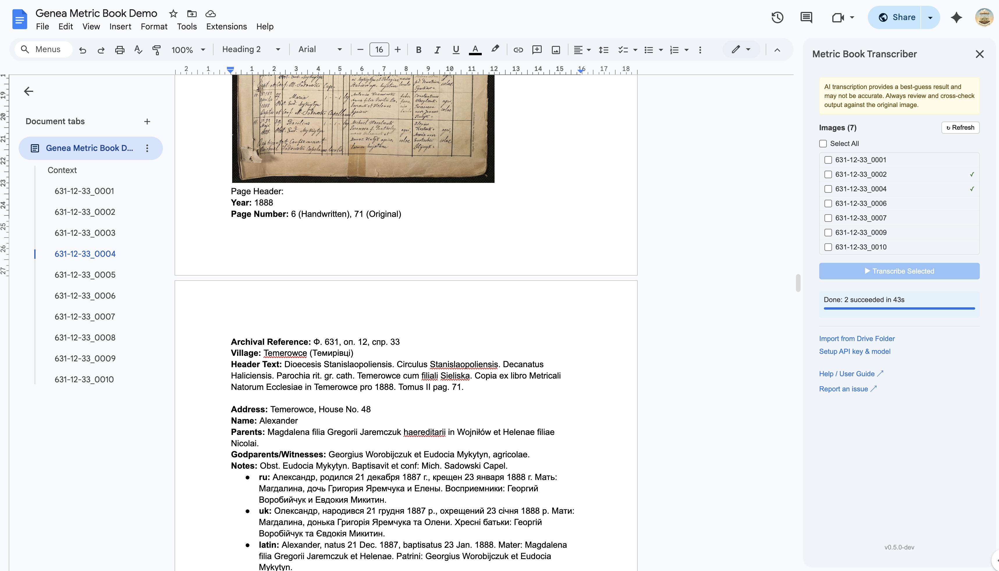

# 📖 User Guide — Metric Book Transcriber Add-On

This add-on helps you transcribe images of metric books (birth, marriage, death registers) using **Google™ AI (Gemini™)**. You can **import scan images from a Google Drive™ folder** into a document (with a Context block and source links), then **transcribe** selected images; the add-on inserts the transcription **directly below the selected image** with clear formatting.

## 📊 User flow

**Create document & import images**

**Transcribe flow (sidebar — recommended)**

**Transcribe flow (single image — menu)**

## 🔄 Workflow summary

1. **Build the document** — Use **Import Book from Drive Folder** (recommended) or add Context and images manually.
2. **Transcribe** — Open the **Sidebar** and select one or more images to transcribe in batch, or select a single image and run **Transcribe Image** from the menu.
3. **Setup (optional)** — To change your API key or Gemini model anytime, use **Extensions** → **Metric Book Transcriber** → **Setup API key & model**, or click **Setup API key & model** in the sidebar.

**Menu overview**

The **Extensions** → **Metric Book Transcriber** menu includes: **Open Sidebar**, **Transcribe Image**, **Import Book from Drive Folder**, **Setup API key & model**, **Help / User Guide**, and **Report an issue**. You can also open the sidebar by clicking the add-on icon in the right-side panel.

---

## 📁 Import Book from Drive Folder (recommended)

Use this to create a document with a Context section and all scan images from a folder in one go.

1. Open a **new or existing** Google Docs™ document.
2. Go to **Extensions** → **Metric Book Transcriber** → **Import Book from Drive Folder**.
3. When prompted, paste the **Google Drive folder URL or folder ID** that contains your metric book scans. You can copy the URL from the address bar when the folder is open in Drive (e.g. `https://drive.google.com/drive/folders/...`).

   

4. Click **OK**. The add-on will:
   - Add a **Context** section at the top (full sample template with bold labels: archive name, reference, villages, common surnames, etc. — you can edit it).
   - Import **up to 30 images** from the folder (**JPEG, PNG, WebP** only), **natural-sorted** by filename (e.g. page_2 before page_10).
   - For each image: a **Heading 2** with the image name (no extension), a **Source Image Link** line (clickable link to the file in Drive), then the image (scaled to content width), then a page break.

   

5. When the import finishes, you'll see how many images were added (and how many skipped, if any). You can now run **Transcribe Image** on any of them (see below).

   

**📌 Notes:** The folder must be one you own or that's shared with you. Very large or invalid images may be skipped; the add-on reports how many were skipped. Edit the Context block with your actual archive and locality details before transcribing for best results.

---

## 📄 Document structure (if you build the doc manually)

1. **📋 Context section** (required for best results)  
   Add a section titled **Context** near the top of the document. Under it, put any information that helps identify the record, for example:
   - Archive reference (e.g. fond, opis, case)
   - Document description (type of register, parish, locality)
   - Date range of the records
   - Village names
   - Common surnames in the area  

   The add-on sends all text under the heading "Context" to the model. Use plain text or short lines; no special format is required.

2. **🖼️ Images**  
   Below the Context section, insert your metric book images (scans) as usual in Google Docs (Insert → Image → Upload or paste). One image per "page" of the register is typical. You can have multiple images in one document.

## 📂 Transcribe with the Sidebar (recommended)

The sidebar is the easiest way to transcribe one or many images at once.

1. Open **Extensions** → **Metric Book Transcriber** → **Open Sidebar**, or click the add-on icon in the right-side panel and then **Open Transcriber Sidebar**.
2. The sidebar shows a list of all inline images in the document, labeled by their **Heading 2** title (or "Image 1", "Image 2" if no heading). Images that already have a transcription below them are marked with a green checkmark.
3. **Select images** — check the images you want to transcribe, or use **Select All**. You can select a single image or multiple.
4. Click **Transcribe Selected**. If any selected images already have transcription text below them, a confirmation dialog asks whether to replace it.
5. The sidebar processes images in document order. For each image it shows:
   - A progress counter ("Transcribing 2 of 7…")
   - The current image label
   - Elapsed time and estimated time remaining
   - A progress bar
6. When an image completes, it gets a status icon:
   - **Green checkmark** — transcription inserted successfully.
   - **Orange warning** — output may be truncated (`MAX_TOKENS`). The transcription was inserted but may be incomplete.
   - **Red X** — failed (hover for error details). The batch continues with the next image.
7. You can click **Stop** at any time to halt the batch after the current image finishes.
8. When the batch completes, the sidebar shows a summary (e.g. "Done: 7 succeeded in 4m 32s") and auto-refreshes the image list.

**Note:** Each image is transcribed in its own server call (~30–60 seconds per image depending on the model). The sidebar stays responsive during processing, and you can scroll through the document while it runs.

---

## ✍️ How to transcribe a single image (menu)

You can also transcribe one image at a time using the classic menu flow:

1. **🖼️ Click on the image** you want to transcribe so it is selected (handles appear around it).
2. Open **Extensions** → **Metric Book Transcriber** → **Transcribe Image**.

   

3. **🔑 First time only — API key, model, and request setup:** If no API key is configured yet, a **"Set API Key"** dialog appears. It includes a link to [Google AI Studio™](https://aistudio.google.com/app/apikey) where you can get a free key (sign in, click **Create API key**, copy it). In the dialog you can choose the **model**: default is **Gemini Flash Latest** (free tier ~20 requests/day); other options include **Gemini 3.1 Flash Lite** (500 requests/day) and **Gemini 3.1 Pro Preview** (best quality, billing). You can also tune request parameters (`temperature`, `max output tokens`, and model-aware thinking controls). Paste the key, review settings, and click **Save & Continue**. The key/model/config are saved and the transcription proceeds. To change them later, use **Setup API key & model** from the add-on menu. See [rate limits](https://aistudio.google.com/rate-limit) for free tier and billing.

4. A dialog appears: **"Awaiting response from Gemini API… This may take up to 1 minute."** Leave it open until the request finishes (the status bar may show "Working…").

   

5. When the add-on finishes, the dialog closes and you see **"Done — Transcription inserted below the image."** The transcription is inserted **directly under the selected image** (not at the end of the document).

   

6. **✅ Review and edit** the result in the document. **Quality Metrics** and **Assessment** lines are colored (blue and red) so they stand out from the historical data.

   

### Setup API key & model

To change your API key, Gemini model, or request behavior anytime (for example after hitting free-tier limits or to try different transcription quality settings), use **Extensions** → **Metric Book Transcriber** → **Setup API key & model**. In the dialog you can pick a model, tune `temperature`, `max output tokens`, and thinking settings, enter a new API key (or leave it blank to keep the current one), and click **Save**. Use **Clear stored API key** to remove your key so you’ll be prompted again on the next Transcribe.

## 📝 What the output looks like

The transcription includes:

- **📌 Page header** — Year, page number, archival references, village names if visible.
- **📋 Per record** — For each birth, marriage, or death on the page (as **standard paragraphs**, not bullets):
  - **Address** (village, house number).
  - **Name(s)** — main person(s), then parents, godparents (births) or witnesses (marriages).
  - **Notes** — extra details from the record.
- **🔵 Quality Metrics** (shown in **blue**) — e.g. Handwriting quality (3/5), Trust score (4/5).
- **🔴 Assessment** (shown in **red**) — e.g. Quality of output (2/5), correction notes.
- **🌐 Language summaries** (as a **bulleted list**) — Russian, Ukrainian, Latin (original), English.

Blank lines separate records for readability. You can edit any of this text in the document.

## 💡 Tips

- **📋 Context:** The more precise the context (archive, dates, villages, surnames), the better the transcription and name normalization.
- **🖼️ Image quality:** Clear, upright scans work best. Cropping to the relevant table or page helps.
- **📂 Use the Sidebar for batch:** Open the Sidebar to transcribe multiple images at once. For single images, you can also select one and run "Transcribe Image" from the menu.

## 🔧 Troubleshooting

| Issue | What to do |
|-------|------------|
| **"Please select a single image"** | Click on one metric book image so it is selected, then run **Transcribe Image** again. |
| **Invalid Drive Folder link** | Paste the full folder URL from the Drive address bar (e.g. `https://drive.google.com/drive/folders/...`) or the folder ID. Use a **folder** link, not a file. |
| **Cannot access folder** | The folder must be owned by you or shared with you. If you added Drive access recently, re-authorize (revoke the app in Google Account → Third-party apps, then run Import again). |
| **No images found in this folder** | Only JPEG, PNG, and WebP are imported. Add at least one image in one of these formats. |
| **Some images skipped** | Very large or invalid images may be skipped; the add-on reports how many. Resize or re-export large scans if needed. |
| **"Set API Key" dialog / API key prompt** | The add-on prompts for a key and model on first use of **Transcribe Image**. Get a free key at [Google AI Studio](https://aistudio.google.com/app/apikey), paste it, choose a model, and click **Save & Continue**. To change key or model later, use **Extensions** → **Metric Book Transcriber** → **Setup API key & model**. See [INSTALLATION.md](INSTALLATION.md). |
| **Setup dialog validation error** | Check request fields in **Setup API key & model**. `temperature` must be `0..2`; `max output tokens` must be an integer `1..65536`; and thinking options depend on the selected model. |
| **"Authorisation is required to perform that action"** | Usually means you are a collaborator on the doc and haven’t authorized the add-on for your account. Open **Extensions** → **Metric Book Transcriber** and complete the authorization when prompted. |
| **Quota exceeded / 429 / rate limit** | Free tier has limited requests per day. The add-on shows the error in the dialog. Check [rate limits](https://aistudio.google.com/rate-limit); switch model or enable billing via **Setup API key & model** if needed. |
| **Request failed / API error** | Check that your API key is valid and that the Generative Language API is enabled. If you see a quota or billing message, check [rate limits](https://aistudio.google.com/rate-limit) and your Google AI™ or Google Cloud™ project settings. |
| **Timeout** | The add-on waits up to about 60 seconds. If the request times out, try again or use a smaller/simpler image. |
| **Empty or odd transcription** | Ensure the selected element is the image (not a drawing or text). Add or improve the Context section and try again. |
| **Transcription at bottom of doc** | Ensure you have the latest script; insertion uses the body-level block containing the selected image. Select the image and run again. |
| **Sidebar shows "No images found"** | The document has no inline images. Import scans via **Import Book from Drive Folder** or paste images directly into the document, then click **Refresh**. |
| **Sidebar image failed (red X)** | Hover over the red X to see the error. Common causes: API rate limit (429), image too large, network timeout. The batch continues with the remaining images. You can retry the failed image afterward. |
| **Orange warning on sidebar image** | The model's output was truncated (`MAX_TOKENS`). The transcription was inserted but may be incomplete. Try a smaller or clearer image, or switch to a model with higher output limits. |
| **"No homepage card" on right panel icon** | Ensure the latest code is deployed. The right-side icon shows a Card with an "Open Transcriber Sidebar" button. If you see this error, redeploy via `clasp push --force` or update the test deployment. |

For installation and API key setup, see [INSTALLATION.md](INSTALLATION.md).
