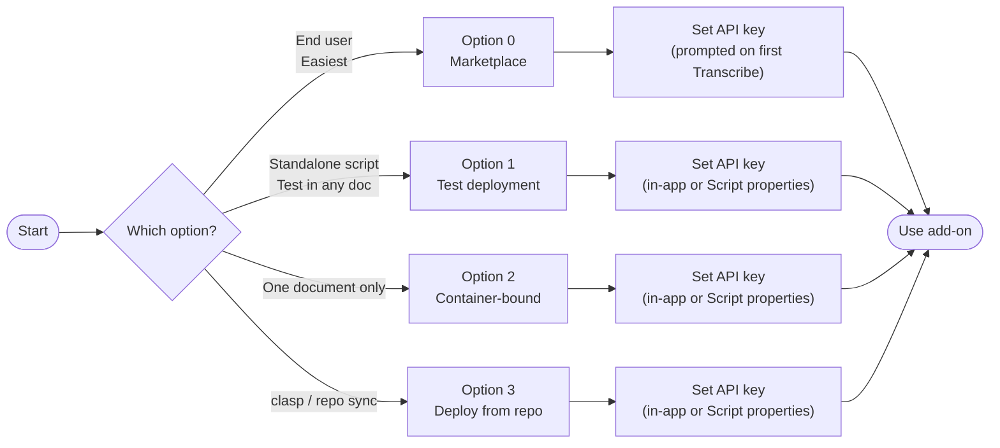
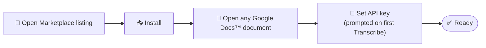
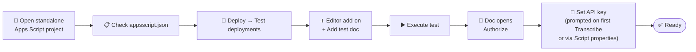
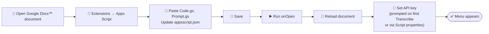
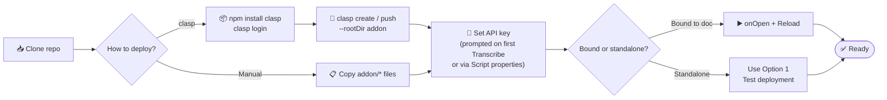
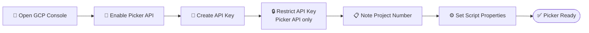

# ⚙️ Installation — Metric Book Transcriber Add-On

This add-on runs in Google Docs™ and uses the **Google™ AI (Gemini™)** API to transcribe metric book images. Choose one of the installation options below. The API key can be entered the first time you run **Transcribe Image** (the add-on will prompt you), or set manually in Script properties.

## 🗺️ Choose your installation path



| Path | Best for |
|------|----------|
| **Option 0** | **Recommended.** Install from the [Google Workspace™ Marketplace](https://workspace.google.com/marketplace/) — one click, works in any Google Docs™ document. |
| **Option 1** | Standalone Apps Script project; run in any doc via **Test deployments** (Editor add-on). |
| **Option 2** | One **Google Docs™** document; script lives inside that document (**Extensions → Apps Script**). |
| **Option 3** | Using **clasp** or copying from repo; then follow Option 1 or 2 depending on project type. |

---

## ✅ Prerequisites

- **📧** A **Google Account™** (personal or **Google Workspace™**).
- **📄** A **Google Docs™** document where you want to transcribe metric book images.
- **🔑** A **Google™ AI (Gemini™) API key**. Get one at [Google AI Studio™](https://aistudio.google.com/api-keys) or [Google Cloud™ Console](https://console.cloud.google.com/) (enable the Generative Language API and create an API key). You can skip this step — the add-on will prompt you with instructions and a link on first use of **Transcribe Image**.

---

## 🏪 Option 0: Install from Google Workspace™ Marketplace (recommended)

This is the easiest option for end users. No code, no setup — just install and go.



1. **🏪** Open the **Metric Book Transcriber** listing on the [Google Workspace™ Marketplace](https://workspace.google.com/marketplace/) (search for "Metric Book Transcriber" or use the direct link once published).
2. **📥** Click **Install** and grant the requested permissions.
3. **📄** Open any **Google Docs™** document. You should see the menu **Extensions** → **Metric Book Transcriber** with **Open Sidebar**, **Transcribe Image**, **Import Book from Drive Files**, **Extract Context from Cover Image**, **Setup AI**, and more. You can also click the add-on icon in the right-side panel to open the sidebar.
4. **🔑** The first time you run **Transcribe Image**, the add-on prompts you to enter a [Google™ AI (Gemini™) API key](https://aistudio.google.com/api-keys) and choose a model (default: Gemini™ Flash Latest, free tier ~20 requests/day). Get a key, paste it, pick a model, and click **Save & Continue**. Your key and model are stored privately (per user). To change them later, use **Setup AI**. In the same dialog you can set **Interface language** (English, Ukrainian, Russian, or Auto to follow your **Google Account™**). See [Gemini™ API pricing](https://ai.google.dev/gemini-api/docs/pricing) for model and token cost details.

That's it — you can now import images from Drive and transcribe them. See the [User Guide](USER_GUIDE.html) for step-by-step usage.

---

## 1️⃣ Option 1: Add-on deployment (standalone project)

Use this option if your script lives in a **standalone** Apps Script project (e.g. created at [script.google.com](https://script.google.com)). You run it in the context of a document via **Test deployments**.

**⚠️ Important:** Test deployments must use the **Editor add-on** type and have a **test document** selected. Without this, the add-on menu will not appear in the document.



1. **📂 Open your standalone project** in the Apps Script editor.
2. **📋** Ensure `appsscript.json` matches the repo (no `addOns` block; includes `script.container.ui` scope). See `addon/appsscript.json`.
3. **🚀 Create a test deployment:**
   - **Deploy** → **Test deployments**.
   - Under **Select type**, choose **Editor add-on** (not "Google Workspace add-on").
   - In **Configuration**, click **+ Add test**.
   - Select your **test document** (the **Google Docs™** document you will use; create one if needed).
   - Set **Version** to **Latest code** (and **Enabled** as needed).
   - Save. (See `docs/TestDeployments_popup.jpg` for reference if available.)
4. **▶️ Run the test:** In the Test deployments dialog, select your saved test and click **Execute**. The test document opens with the add-on available.
5. **📄** In the document you should see the **Metric Book Transcriber** menu (e.g. **Extensions** → **Metric Book Transcriber** → **Open Sidebar**, **Transcribe Image**, **Import Book from Drive Files**, **Extract Context from Cover Image**, **Setup AI**). Authorize when prompted.
6. **🔑** Set the API key and model. You have two options:
   - **In-app (recommended):** Just run **Transcribe Image** — if no key is set, a dialog appears with a link to [Google AI Studio™ — API keys](https://aistudio.google.com/api-keys), model choice (default: Gemini™ Flash Latest), and an API key field. Enter the key, pick a model, and click **Save & Continue**. To change key or model later, use **Setup AI**.
   - **Manual:** **Project Settings** → **Script properties** → add `GEMINI_API_KEY` with your key. (Note: the in-app dialog stores the key and model per user; manual Script properties are shared across all users of the project.)

The add-on runs in the context of the test document. When you run **Transcribe Image**, a dialog shows "Awaiting response from Gemini™ API… This may take up to 1 minute." To test with the latest code, keep **Latest code** in the test and refresh the document after saving changes.

---

## 2️⃣ Option 2: Add script to document (container-bound)

Use this option to attach the add-on directly to **one document**. The script is **bound** to that document.



1. **📄 Open the Google Docs™ document** you use for metric books (or create a new one).
2. **🔌** **Extensions** → **Apps Script**. This opens the script editor bound to this document.
3. **📝 Replace the default script** with the add-on code:
   - Delete the default `Code.gs` content and paste the contents of `addon/Code.gs` from this repo.
   - Add a file **Prompt.gs** and paste the contents of `addon/Prompt.gs`.
   - **Project Settings** (gear) → enable **Show "appsscript.json" manifest file in editor**, then open `appsscript.json` and replace its contents with `addon/appsscript.json` from this repo.
4. **💾 Save** the project (Ctrl+S / Cmd+S).
5. **▶️** Run **onOpen** once from the script editor (authorize if prompted). **🔄 Reload** the document; the menu **Extensions** → **Metric Book Transcriber** (Transcribe Image, Import Book from Drive Files, Setup AI) should appear.
6. **🔑** Set the API key: run **Transcribe Image** and the add-on will prompt you with instructions and a link to [Google AI Studio™ — API keys](https://aistudio.google.com/api-keys). Alternatively, set it manually in **Project Settings** → **Script properties** (note: the in-app dialog stores the key per user; manual Script properties are shared).

---

## 3️⃣ Option 3: Deploy from repo (clasp or manual)

Use this option if you use [clasp](https://github.com/google/clasp) or want to keep the add-on in sync with this repository.



1. **📥** Clone this repo and `cd` into it.
2. **With clasp:**  
   - `npm install -g @google/clasp`  
   - **Enable the Apps Script API**: go to [script.google.com/home/usersettings](https://script.google.com/home/usersettings) and toggle **Google Apps Script API** to **On** (required for clasp to push code).  
   - `clasp login`  
   - Create a new Apps Script project: `clasp create --type docs --title "Metric Book Transcriber" --rootDir addon` (or clone an existing project and set `rootDir` to `addon`).  
   - `clasp push`.
3. **Without clasp:** Copy the contents of `addon/Code.gs`, `addon/Prompt.gs`, and `addon/appsscript.json` into your Apps Script project (create one from a document via **Extensions** → **Apps Script**, or create a standalone at script.google.com).
4. **🔑** Set the API key and model: run **Transcribe Image** and the add-on will prompt you (or use **Setup AI**), or set the key manually in **Project Settings** → **Script properties** (note: the in-app dialog stores the key and model per user; manual Script properties are shared).
5. If the script is **bound to a document**, run **onOpen** once and reload the doc. If it is **standalone**, use **Option 1** (Test deployments) to run it in a document.

---

## 🖼️ Add-on logo

The manifest (`appsscript.json`) includes an `addOns` block with a `logoUrl` pointing to the icon hosted in this repo. The `logoUrl` must be a **public HTTPS URL** (e.g. a GitHub raw URL or Cloud Storage). Required sizes for the Marketplace listing: **128×128 px** and **32×32 px** (square, color, transparent background). See `addon/img/README.md` for details.

## 🔑 API key and model

- The API key and selected model are stored in **User Properties** (private to each **Google Account™**), not in the code. Each user's key and model choice are isolated.
- On first use of **Transcribe Image**, if no key is set, the add-on shows a dialog with a link to [Google AI Studio™ — API keys](https://aistudio.google.com/api-keys), a **model** dropdown (default: Gemini™ Flash Latest; options include Gemini™ 3.1 Flash Lite and Gemini™ 3.1 Pro Preview), and an API key field. After entering the key and clicking **Save & Continue**, both are saved and the transcription proceeds.
- To **update key or model** anytime: **Extensions** → **Metric Book Transcriber** → **Setup AI**. Leave the API key blank to keep the current key; change the model and click **Save**. Use **Clear stored API key** in that dialog to remove the key (you will be prompted again on next Transcribe).
- The same setup dialog also supports request tuning: **Transcription strictness** (default `0.1`), **Max text length**, **Reasoning depth**, and (when supported) **Reasoning effort limit**. Invalid combinations are blocked in the UI and revalidated server-side.
- Pricing and billing details: see [Gemini™ API pricing](https://ai.google.dev/gemini-api/docs/pricing).

## 🎛️ Setting up Google Picker™ API for Production (Publishers/Deployers only)

**⚠️ This section is for publishers and deployers** setting up the add-on for **production use** (Marketplace listing, organization-wide deployment). **End users do not need to configure this** — **Google Picker™** is pre-configured by the publisher.

The add-on uses the **Google Picker™ API** for the "Import Book from Drive Files" feature. When properly configured, users see a native **Google Picker™** to select images. If not configured, a manual fallback (paste file URLs/IDs) is available.

### Prerequisites

- A **Google Cloud Console project** for your add-on
- **Owner or Editor** role on that project
- The add-on deployed to that project (via clasp or Cloud Console)

### Setup Steps



1. **📂 Open Google Cloud Console:**
   - Go to [console.cloud.google.com](https://console.cloud.google.com/)
   - Select the project used for your add-on (the one linked in `appsscript.json` or OAuth consent screen)

2. **🔌 Enable the Google Picker™ API:**
   - Navigate to **APIs & Services** → **Library**
   - Search for **Google Picker™ API**
   - Click **Enable**
   - (Note: The Picker API itself doesn't require enabling in newer GCP projects; this step may be automatic)

3. **🔑 Create an API Key:**
   - Navigate to **APIs & Services** → **Credentials**
   - Click **+ CREATE CREDENTIALS** → **API key**
   - Copy the generated API key (e.g., `AIzaSy...`)

4. **🔒 Restrict the API Key (Recommended):**
   - Click **Edit API key** (pencil icon) for the key you just created
   - Under **API restrictions**, select **Restrict key**
   - In the dropdown, find and select **Google Picker™ API**
   - (Optional) Under **Application restrictions**, you can restrict by HTTP referrers (e.g., `*.googleusercontent.com/*` for Apps Script dialogs)
   - Click **Save**

5. **📋 Get the Project Number (App ID):**
   - In the Google Cloud Console, go to the **Dashboard** (left sidebar)
   - The **Project number** is displayed near the top (e.g., `123456789012`)
   - Copy this number — it's your Picker App ID

6. **⚙️ Set Script Properties in Apps Script:**
   - Open your Apps Script project (the one you deployed)
   - Go to **Project Settings** (gear icon)
   - Scroll to **Script Properties**
   - Add two properties:
     - **Property:** `GOOGLE_PICKER_API_KEY`  
       **Value:** Your API key from step 3 (e.g., `AIzaSy...`)
     - **Property:** `GOOGLE_PICKER_APP_ID`  
       **Value:** Your project number from step 5 (e.g., `123456789012`)
   - Click **Save script properties**

7. **✅ Verify Configuration:**
   - Open a **Google Docs™** document
   - Run **Extensions** → **Metric Book Transcriber** → **Import Book from Drive Files**
   - The **Google Picker™** dialog should open and show "Ready." status
   - Click **Open Drive Picker** — the **Google Picker™** modal should appear showing your **Google Drive™** files
   - If it fails, check the **Troubleshooting** section below

### Alternative: Set via clasp

If you use `clasp`, you can set script properties from the command line:

```bash
# Set Picker API key
clasp setting scriptId YOUR_SCRIPT_ID
clasp open
# Then set properties via Project Settings UI, or use the Apps Script API
```

(Note: `clasp` doesn't have a direct command to set script properties; use the UI or Apps Script API)

### Fallback Behavior

If the Picker API is **not configured** (script properties missing or invalid):
- The "Import Book from Drive Files" dialog shows an error: "Picker is not configured. Set script properties GOOGLE_PICKER_API_KEY and GOOGLE_PICKER_APP_ID (Cloud project number)."
- Users can click **"Use manual links/IDs"** to paste Drive file URLs or IDs instead
- Import still works via manual input — Picker is a UX enhancement, not required

### For Developers (Local Testing)

Developers working on the add-on codebase need their own Picker configuration:
1. Create a personal GCP project (or use an existing one)
2. Follow steps 1-5 above to get an API key and project number
3. Set script properties in your **local test deployment**:
   - Open your test Apps Script project
   - **Project Settings** → **Script Properties** → add `GOOGLE_PICKER_API_KEY` and `GOOGLE_PICKER_APP_ID`
4. `clasp push` and test in a **Google Docs™** document

Each developer's keys are private to their test environment. Production keys are set once by the publisher.

### Security Notes

- **API Key restriction:** Always restrict the API key to **Google Picker™ API only** (step 4). Do not use unrestricted keys.
- **Script Properties:** These are **shared** across all users of the add-on. Do not put sensitive per-user data here.
- **User Properties vs Script Properties:**
  - **User Properties** (per-user, private): API keys for **Gemini™**, model choice, user settings
  - **Script Properties** (shared, public to code): Picker API key, App ID (public to all users of the deployment)

### References

- [Google Picker™ API Overview](https://developers.google.com/drive/picker/guides/overview)
- [Google Cloud Console](https://console.cloud.google.com/)
- [SPEC-9-OAUTH-SCOPE-MIGRATION.md](../project/SPEC-9-OAUTH-SCOPE-MIGRATION.md) — Full Picker integration specification

## 🔧 Troubleshooting

| Issue | What to do |
|-------|------------|
| **Menu doesn't appear** | Reload the document. For container-bound scripts, ensure the script is bound to this document (Extensions → Apps Script opens the same project). For test deployments, run **Execute** from Deploy → Test deployments. |
| **"Please set your Google AI API key" / no key** | Run **Transcribe Image** — the add-on will prompt you to enter a key and choose a model, with a link to [Google AI Studio™ — API keys](https://aistudio.google.com/api-keys). Or use **Setup AI** to set or change key and model. |
| **Setup dialog shows validation error** | Check request settings in **Setup AI**. **Transcription strictness** must be between `0` and `2`; **Max text length** must be an integer between `1` and `65536`; reasoning options depend on the selected model. |
| **"Authorisation is required to perform that action"** | You may be a collaborator on the doc (not the person who added the add-on). Install the add-on for your account: **Extensions** → **Metric Book Transcriber** and complete the authorization when prompted. Or remove and re-add the add-on to re-authorize. |
| **Quota exceeded / 429** | Free tier has limited requests per day (e.g. ~20 for Gemini™ Flash Latest). The add-on shows the API error in the dialog. Check [Gemini™ API pricing](https://ai.google.dev/gemini-api/docs/pricing) and your quota/billing setup; consider switching model via **Setup AI**. |
| **Cannot access selected files** (Import from Drive) | Ensure each file is shared with you or owned by you. If using a **custom GCP project** (e.g. for Marketplace), enable the **Google Drive™ API** in that project: [APIs & Services → Library → Google Drive™ API](https://console.cloud.google.com/apis/library/drive.googleapis.com). Re-authorize the add-on if you changed permissions. |
| **Picker not configured / "Use manual links/IDs"** | The Google Picker™ API is not configured (publisher/deployer setup only). Click **"Use manual links/IDs"** in the Import dialog and paste Drive file URLs or IDs instead. If you are the publisher/deployer, see the **Setting up Google Picker™ API for Production** section above. |
| **Picker fails to open / API load error** | Check network connection and ensure `apis.google.com` is not blocked. If the error persists, use the **"Use manual links/IDs"** fallback. Verify Picker API key and App ID in script properties (publisher/deployer only). |
| **API errors / 403** | Confirm the API key is valid and the Generative Language API is enabled. Check [Google AI Studio™ — API keys](https://aistudio.google.com/api-keys) or Cloud Console. |
| **Timeout** | The script uses a 60-second timeout. Try a smaller image or try again. |

For usage (document structure, Context section, step-by-step with screenshots), see [USER_GUIDE.html](USER_GUIDE.html).
