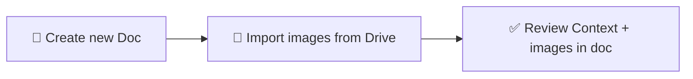
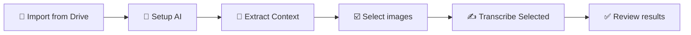
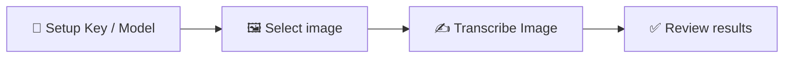

# 📖 User Guide — GeneaScript Transcriber

This add-on helps you transcribe images of metric books (birth, marriage, death registers) using **Google™ AI (Gemini™)**. You can **import scan images from Google Drive™ file links/IDs that you select** into a document (with a Context block and source links), then **transcribe** selected images; the add-on inserts the transcription **directly below the selected image** with clear formatting.

## 📊 User flow

**Create document & import images**

**Transcribe flow (sidebar — recommended)**

**Transcribe flow (single image — menu)**

## 🔄 Workflow summary

1. **Build the document** — Use **Import Book from Drive Files** (recommended) or add Context and images manually.
2. **Select Template (if needed)** — If your source material is not a Galician Greek Catholic register, open **Select Template** from the menu or sidebar to choose the matching record profile (e.g. Russian Imperial Orthodox or Generic verbatim for letters and non-tabular text).
3. **Transcribe** — Open the **Sidebar** and select one or more images to transcribe in batch, or select a single image and run **Transcribe Image** from the menu.
4. **Setup (optional)** — To change your API key or **Gemini™** model anytime, use **Extensions** → **GeneaScript** → **Setup AI**, or click **Setup AI** in the sidebar.
5. **Extract Context from cover image (recommended after import)** — Use **Extract Context from Cover Image** (menu) or **Extract Context from Selected Image** (sidebar) to auto-fill Context fields from a title page, then review and edit before applying.

**Menu overview**

The **Extensions** → **GeneaScript** menu includes: **Open Sidebar**, **Transcribe Image**, **Import Book from Drive Files**, **Extract Context from Cover Image**, **Select Template**, **Setup AI**, **Help / User Guide**, and **Report an issue**. You can also open the sidebar by clicking the add-on icon in the right-side panel.

### Interface language

The add-on UI is available in **English**, **Ukrainian**, and **Russian**. By default it follows your **Google Account™** language. To override, open **Setup AI** or **Settings** and set **Interface language** to **Auto**, **English**, **Українська**, or **Русский**. The choice is saved for your account; reopen the document (or refresh the menu) to see menu labels update. Document content such as the **Context** heading is unchanged so automatic context detection keeps working.

---

## 📁 Import Book from Drive Files (recommended)

Use this to create a document with a Context section and scan images from your **Google Drive™** in one go.

1. Open a **new or existing** Google Docs™ document.
2. Go to **Extensions** → **GeneaScript** → **Import Book from Drive Files**.
3. A **Google Picker™** dialog opens, automatically starting in **your document's parent folder** (if the document is saved in a **Google Drive™** folder).

   

4. **Browse and select images:**
   - **Images tab**: Flat view of all accessible images (JPEG, PNG, WebP only)
   - **Folders tab**: Browse folder structure with breadcrumb navigation
   - Use the **search bar** to find files by name
   - **Multi-select** supported: select up to 30 images at once
   - Click **Select** when ready (or **Cancel** to abort)

   

5. The add-on imports selected files and:
   - Adds a **Context** section at the top (full sample template with bold labels: archive name, reference, villages, common surnames, etc. — you can edit it).
   - Imports **up to 30 selected images** (**JPEG, PNG, WebP** only), **natural-sorted** by filename (e.g. page_2 before page_10).
   - For each image: a **Heading 2** with the image name (no extension), a **Source Image Link** line (clickable link to the file in **Google Drive™**), then the image (scaled to content width), then a page break.

6. When the import finishes, a status message shows how many images were added (and how many skipped, if any). You can now run **Transcribe Image** on any of them (see below).

**📌 Notes:** 
- Only files you select via **Google Picker™** are accessible to the add-on (narrower OAuth scope for better security).
- Non-image files are automatically filtered out and skipped with a message.
- Very large images or inaccessible files may be skipped; the add-on reports counts.
- Edit the Context block with your actual archive and locality details before transcribing for best results.

---

## 📄 Document structure (if you build the doc manually)

1. **📋 Context section** (required for best results)  
   Add a section titled **Context** near the top of the document. Under it, put any information that helps identify the record, for example:
   - Archive reference (e.g. fond, opis, case)
   - Document description (type of register, parish, locality)
   - Date range of the records
   - Village names
   - Common surnames in the area  

   The add-on sends all text under the heading "Context" to the model. Use plain text or short lines; no special format is required.

2. **🖼️ Images**  
   Below the Context section, insert your metric book images (scans) as usual in **Google Docs™** (Insert → Image → Upload or paste). One image per "page" of the register is typical. You can have multiple images in one document.

## 📂 Transcribe with the Sidebar (recommended)

The sidebar is the easiest way to transcribe one or many images at once.

1. Open **Extensions** → **GeneaScript** → **Open Sidebar**, or click the add-on icon in the right-side panel and then **Open Transcriber Sidebar**.
2. The sidebar shows the top action flow in order: **Import from Drive Folder**, **Setup AI**, **Extract Context from Selected Image**, then the image list and **Transcribe Selected** action.
3. The image list shows inline images labeled by their **Heading 2** title (or "Image 1", "Image 2" if no heading). Images that already have a transcription below them are marked with a green checkmark.
4. **Select images** — check the images you want to transcribe, or use **Select All**. You can select a single image or multiple.
5. Click **Transcribe Selected**. If any selected images already have transcription text below them, a confirmation dialog asks whether to replace it.
6. The sidebar processes images in document order. For each image it shows:
   - A progress counter ("Transcribing 2 of 7…")
   - The current image label
   - Elapsed time and estimated time remaining
   - A progress bar
7. When an image completes, it gets a status icon:
   - **Green checkmark** — transcription inserted successfully.
   - **Orange warning** — output may be truncated (`MAX_TOKENS`). The transcription was inserted but may be incomplete.
   - **Red X** — failed (hover for error details). The batch continues with the next image.
8. You can click **Stop** at any time to halt the batch after the current image finishes.
9. When the batch completes, the sidebar shows a summary (e.g. "Done: 7 succeeded in 4m 32s") and auto-refreshes the image list.

**Note:** Each image is transcribed in its own server call (~30–60 seconds per image depending on the model). The sidebar stays responsive during processing, and you can scroll through the document while it runs.

---

## 🧾 Extract Context from cover/title page

This feature helps you populate the `Context` section automatically from a cover/title image after Drive import.

1. Import images with **Import Book from Drive Files**.
2. Start extraction using either:
   - **Extensions** → **GeneaScript** → **Extract Context from Cover Image**, or
   - Sidebar action **Extract Context from Selected Image** (select exactly one image first).
3. Select the cover/title image and click **Extract**.
4. Review AI-extracted fields (archive name/reference, document description, date range, villages, surnames, notes).
5. Edit any field as needed and click **Apply Context**.
6. On success, the popup closes automatically and updates are written to the top `Context` section.

The add-on updates known Context fields and merges list items where possible. You can continue manual edits afterward.

---

## 📋 Template Gallery — Select a record profile

Different metric books use different languages, column structures, and conventions. The **Template Gallery** lets you choose a **record profile** that matches your source material. Each template provides a specialized AI prompt with region-specific linguistic hints, column schemas, and terminology — significantly improving transcription accuracy.

### Available templates

| Template | Region | Religion | Best for |
|----------|--------|----------|----------|
| **Galician Greek Catholic** (default) | Galicia (Austrian Empire) | Greek Catholic | Latin/Polish/Ukrainian registers with Latinized names, Polish surname orthography |
| **Russian Imperial Orthodox** | Russian Empire | Orthodox | Pre-reform Russian Cyrillic registers with Church Slavonic influence, patronymics, Julian calendar dates |
| **Generic — verbatim text** | Any source | N/A | Handwritten letters, typescript, diaries, notes, or any non-tabular text |

### How to select a template

1. Open the Template Gallery using either:
   - **Extensions** → **GeneaScript** → **Select Template**, or
   - Click the **Template** button in the sidebar (shows the currently selected template name).
2. In the dialog, select the template that matches your source material (radio button selection).
3. Click **Review Template** to expand a tabbed preview with six sections: **Context** (shows your live document context), **Role**, **Columns**, **Output Format**, **Instructions**, and **Full Prompt** (the exact text sent to the AI).
4. Use the **Copy prompt** button (top-right corner or inside the Full Prompt tab) to copy the assembled prompt to your clipboard — useful for pasting into AI Studio, ChatGPT, or building fine-tuning datasets.
5. Click **Apply** to save.

The selected template is stored **per document** — each document remembers its own template. All subsequent transcriptions in that document will use the selected template's prompt. Already-transcribed images are not affected; only new transcriptions use the new template.

### When to change templates

- If you are starting work on a **Russian Imperial metric book** (Метрическая книга) after previously working on Galician records, switch to the **Russian Imperial Orthodox** template.
- If your results seem off (wrong column interpretation, incorrect language assumptions), check that the correct template is selected for your source material.
- The **Galician Greek Catholic** template is the default and works best for Latin-script Galician registers.

### Custom Templates (v1.4+)

You can create your own transcription templates based on the official ones or from scratch. Custom templates let you fine-tune the AI prompt sections — **Role**, **Input Structure**, **Output Format**, **Instructions**, and **Context Defaults** — for your specific source material.

#### Create a custom template

1. Open the **Template Gallery** (sidebar button or menu).
2. Scroll to the **My Templates** section at the bottom.
3. Choose one of:
   - **Create from Template** — pick an official template as a starting point (inherits all sections).
   - **Create Blank** — start with empty Role/Input Structure and default scaffolds for Output Format, Instructions, and Context Defaults.
4. The **Template Editor** opens.

#### Edit a custom template

1. Fill in **Template Name** and **Description** (both required).
2. Use the **tabs** to edit each section independently:
   - **Role** — who the AI should act as (e.g. "expert archivist specializing in Polish parish registers")
   - **Input Structure** — describe the source material columns and conventions
   - **Output Format** — how the transcription should be structured
   - **Instructions** — step-by-step transcription process
   - **Context Defaults** — default Context field labels for new documents
3. For templates based on an official parent, use **Reset** to restore a section to its inherited value.
4. Click **Save**. The gallery reopens showing your new template.

#### Manage custom templates

From the **My Templates** section in the gallery, each template card shows:

- **Custom** badge (your own) or **Shared** badge (exported by a collaborator)
- Action buttons: **Edit**, **Duplicate**, **Export to Doc**, **Delete**

**Export to Doc** saves your template into the current document's properties, making it available to collaborators who open the same document (shown with a Shared badge, read-only).

You can have up to **5 custom templates** per user account.

#### Apply a custom template

Select any custom template in the gallery and click **Apply** — it works exactly like official templates. The sidebar label updates to show the custom template name.

---

## ✍️ How to transcribe a single image (menu)

You can also transcribe one image at a time using the classic menu flow:

1. **🖼️ Click on the image** you want to transcribe so it is selected (handles appear around it).
2. Open **Extensions** → **GeneaScript** → **Transcribe Image**.

   

3. **🔑 First time only — API key, model, and request setup:** If no API key is configured yet, a **"Set API Key"** dialog appears. It includes a link to [Google AI Studio™ — API keys](https://aistudio.google.com/api-keys) where you can create a key (sign in, click **Create API key**, copy it). In the dialog you can choose the **model**: default is **Gemini™ Flash Latest** (free tier ~20 requests/day); other options include **Gemini™ 3.1 Flash Lite** (500 requests/day) and **Gemini™ 3.1 Pro Preview** (best quality, billing). You can also tune **Transcription strictness**, **Max text length**, and **Reasoning depth** (plus **Reasoning effort limit** when supported), each with a short impact hint for transcription behavior. Paste the key, review settings, and click **Save & Continue**. The key/model/config are saved and the transcription proceeds. To change them later, use **Setup AI** from the add-on menu. See [Gemini™ API pricing](https://ai.google.dev/gemini-api/docs/pricing) for model and token costs.

4. A dialog appears: **"Awaiting response from Gemini™ API… This may take up to 1 minute."** Leave it open until the request finishes (the status bar may show "Working…").

   

5. When the add-on finishes, the dialog closes and you see **"Done — Transcription inserted below the image."** The transcription is inserted **directly under the selected image** (not at the end of the document).

   

6. **✅ Review and edit** the result in the document. **Quality Metrics** and **Assessment** lines are colored (blue and red) so they stand out from the historical data.

   

### Setup AI

To change your API key, **Gemini™** model, or request behavior anytime (for example after hitting free-tier limits or to try different transcription quality settings), use **Extensions** → **GeneaScript** → **Setup AI**. In the dialog you can pick a model, tune **Transcription strictness**, **Max text length**, and **Reasoning depth**, and review short notes that explain how each parameter can affect transcription quality/latency/cost. On models that support it, you can also set **Reasoning effort limit**. Enter a new API key (or leave it blank to keep the current one), and click **Save**. Use **Clear stored API key** to remove your key so you’ll be prompted again on the next Transcribe.

## 📝 What the output looks like

The transcription includes:

- **📌 Page header** — Year, page number, archival references, village names if visible.
- **📋 Per record** — For each birth, marriage, or death on the page (as **standard paragraphs**, not bullets):
  - **Address** (village, house number).
  - **Name(s)** — main person(s), then parents, godparents (births) or witnesses (marriages).
  - **Notes** — extra details from the record.
- **🔵 Quality Metrics** (shown in **blue**) — e.g. Handwriting quality (3/5), Trust score (4/5).
- **🔴 Assessment** (shown in **red**) — e.g. Quality of output (2/5), correction notes.
- **🌐 Language summaries** (as a **bulleted list**) — Russian, Ukrainian, Latin (original), English.

Blank lines separate records for readability. You can edit any of this text in the document.

## 💡 Tips

- **📋 Context:** The more precise the context (archive, dates, villages, surnames), the better the transcription and name normalization.
- **🖼️ Image quality:** Clear, upright scans work best. Cropping to the relevant table or page helps.
- **📂 Use the Sidebar for batch:** Open the Sidebar to transcribe multiple images at once. For single images, you can also select one and run "Transcribe Image" from the menu.

## 🔧 Troubleshooting

| Issue | What to do |
|-------|------------|
| **"Please select a single image"** | Click on one metric book image so it is selected, then run **Transcribe Image** again. |
| **Invalid Drive input** | Paste one or more valid **file** URLs/IDs (e.g. `https://drive.google.com/file/d/.../view`), separated by commas or new lines. |
| **Cannot access some files** | Each file must be owned by you or shared with you. If you changed access recently, re-authorize and run import again. |
| **No images found in selection** | Only JPEG, PNG, and WebP are imported. Ensure selected files are images in one of these formats. |
| **Some images skipped** | Very large or invalid images may be skipped; the add-on reports how many. Resize or re-export large scans if needed. |
| **"Set API Key" dialog / API key prompt** | The add-on prompts for a key and model on first use of **Transcribe Image**. Create a key at [Google AI Studio™ — API keys](https://aistudio.google.com/api-keys), paste it, choose a model, and click **Save & Continue**. To change key or model later, use **Extensions** → **GeneaScript** → **Setup AI**. See [INSTALLATION.html](INSTALLATION.html). |
| **Setup dialog validation error** | Check request fields in **Setup AI**. **Transcription strictness** must be `0..2`; **Max text length** must be an integer `1..65536`; and reasoning options depend on the selected model. |
| **"Authorisation is required to perform that action"** | Usually means you are a collaborator on the doc and haven’t authorized the add-on for your account. Open **Extensions** → **GeneaScript** and complete the authorization when prompted. |
| **Quota exceeded / 429 / rate limit** | Free tier has limited requests per day. The add-on shows the error in the dialog. Check [Gemini™ API pricing](https://ai.google.dev/gemini-api/docs/pricing) and your quota/billing setup; switch model or billing settings via **Setup AI** if needed. |
| **Request failed / API error** | Check that your API key is valid and that the Generative Language API is enabled. If you see a quota or billing message, review [Gemini™ API pricing](https://ai.google.dev/gemini-api/docs/pricing) and your Google AI™ or Google Cloud™ project settings. |
| **Timeout** | The add-on waits up to about 60 seconds. If the request times out, try again or use a smaller/simpler image. |
| **Empty or odd transcription** | Ensure the selected element is the image (not a drawing or text). Add or improve the Context section and try again. |
| **Transcription at bottom of doc** | Ensure you have the latest script; insertion uses the body-level block containing the selected image. Select the image and run again. |
| **Sidebar shows "No images found"** | The document has no inline images. Import scans via **Import Book from Drive Files** or paste images directly into the document, then click **Refresh**. |
| **Sidebar image failed (red X)** | Hover over the red X to see the error. Common causes: API rate limit (429), image too large, network timeout. The batch continues with the remaining images. You can retry the failed image afterward. |
| **Orange warning on sidebar image** | The model's output was truncated (`MAX_TOKENS`). The transcription was inserted but may be incomplete. Try a smaller or clearer image, or switch to a model with higher output limits. |
| **Extract Context action says select one image** | In the sidebar, check exactly one image before running **Extract Context from Selected Image**. |
| **Context extraction returns unusable text** | Try a clearer cover image, rerun extraction, then edit fields manually before apply. |
| **"No homepage card" on right panel icon** | Ensure the latest code is deployed. The right-side icon shows a Card with an "Open Transcriber Sidebar" button. If you see this error, redeploy via `clasp push --force` or update the test deployment. |

For installation and API key setup, see [INSTALLATION.html](INSTALLATION.html).
