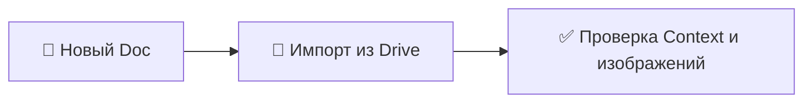
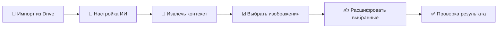

# 📖 Руководство — Дополнение «Транскрибатор метрических книг»

Дополнение помогает расшифровывать изображения метрических книг (акты рождения, брака, смерти) с помощью **Google™ AI (Gemini™)**. Вы можете **импортировать снимки из Google Drive™** (файлы, которые явно выбираете), добавить блок **Context**, затем **расшифровать** выбранные изображения; текст вставляется **сразу под соответствующим изображением**.

## 📊 Схема работы

**Создание документа и импорт**

**Расшифровка (боковая панель — рекомендуется)**

## 🔄 Краткий сценарий

1. **Подготовьте документ** — **Import Book from Drive Files** (рекомендуется) или вручную добавьте Context и изображения.
2. **Шаблон** — если источник не греко-католические метрические книги Галиции, откройте **Select Template** и выберите профиль (например, Российская православная метрическая книга).
3. **Расшифровка** — боковая панель для пакета или одно изображение через меню **Transcribe Image**.
4. **Настройки** — **Extensions** → **Metric Book Transcriber** → **Setup AI** или кнопка на панели.
5. **Контекст с обложки** — **Extract Context from Cover Image** (меню) или **Extract Context from Selected Image** (боковая панель, ровно одно изображение).

### Язык интерфейса

Доступны **английский**, **украинский**, **русский**. По умолчанию — язык аккаунта Google. Переопределение: **Setup AI** или **Settings** → **Interface language** (**Auto**, **English**, **Українська**, **Русский**). Заголовок **Context** в документе не переводится — так работает автоопределение контекста.

Меню **Extensions** → **Metric Book Transcriber**: **Open Sidebar**, **Transcribe Image**, **Import Book from Drive Files**, **Extract Context from Cover Image**, **Select Template**, **Setup AI**, **Help / User Guide**, **Report an issue**.

## 📁 Импорт из Google Drive (рекомендуется)

1. Откройте Google Doc.
2. **Extensions** → **Metric Book Transcriber** → **Import Book from Drive Files**.
3. **Google Picker** открывается в родительской папке документа (если документ в Drive).
4. Вкладки **Images** / **Folders**, поиск, **до 30 изображений** (JPEG, PNG, WebP), **Select**.
5. Добавляется раздел **Context** (шаблон с жирными метками — отредактируйте), для каждого файла: **Heading 2**, **Source Image Link**, изображение, разрыв страницы.

После импорта — сводка (сколько добавлено / пропущено). Доступ только к выбранным файлам (`drive.file`).

## 📄 Структура документа (вручную)

1. **Context** — под заголовком укажите архив, описание, даты, деревни, фамилии. Весь текст под «Context» уходит в модель.
2. **Изображения** — вставьте сканы под Context.

## 📂 Боковая панель (пакет)

1. **Open Sidebar** или значок дополнения.
2. Порядок: импорт, **Setup AI**, извлечение контекста, список изображений, **Transcribe Selected**.
3. Зелёная галочка — расшифровка уже есть; выберите одно или несколько.
4. **Stop** останавливает пакет после текущего изображения.
5. Ошибки — красный крест (наведите для текста); предупреждение — возможна обрезка `MAX_TOKENS`.

## 🧾 Контекст с титульного листа

После импорта: меню **Extract Context from Cover Image** или панель с **одним** выбранным изображением → **Extract** → проверка полей → **Apply Context**.

## 📋 Галерея шаблонов

**Select Template** (меню или кнопка на панели). Профили, в том числе **Galician Greek Catholic** и **Russian Imperial Orthodox**. **Review Template** — вкладки Context (живой текст из документа), Role, Columns, Output, Instructions. Шаблон хранится **на документ**. Новые расшифровки используют выбранный шаблон.

## ✍️ Одно изображение (меню)

1. Щёлкните **по изображению** (рамка выделения).
2. **Transcribe Image**.
3. Первый запуск — диалог ключа API и модели ([Google AI Studio](https://aistudio.google.com/api-keys)), **Save & Continue**.
4. Дождитесь окончания; текст появится **под изображением**.
5. Проверьте **Quality Metrics** (синие) и **Assessment** (красные).

**Setup AI** — смена ключа, модели, строгости, длины вывода, режима рассуждения.

## 📝 Формат результата

Заголовок страницы, записи абзацами (адрес, имена, заметки), метрики качества, оценка, затем **языковые резюме** (русский, украинский, латиница, английский) списком.

## 💡 Советы

- Чем точнее **Context**, тем лучше нормализация имён.
- Чёткие сканы и обрезка лишнего улучшают результат.
- Для нескольких страниц удобнее боковая панель.

## 🔧 Устранение неполадок

| Проблема | Что делать |
|----------|------------|
| Выберите одно изображение | Щёлкните по изображению и повторите. |
| Нет доступа к файлам | Файлы должны быть ваши или расшарены; переавторизуйтесь. |
| Нет изображений в выборе | Только JPEG/PNG/WebP. |
| Диалог ключа API | Создайте ключ в AI Studio, сохраните в **Setup AI**. Подробнее — [INSTALLATION.html](INSTALLATION.html). |
| 429 / квота | Проверьте тариф Gemini; смените модель в **Setup AI**. |
| Таймаут (~60 с) | Повторите или уменьшите изображение. |
| Панель: нет изображений | Импортируйте или вставьте, **Refresh**. |
| Красный крест в списке | Наведите курсор; часто сеть или квота; повторите позже. |

Установка и ключ: [INSTALLATION.html](INSTALLATION.html).
