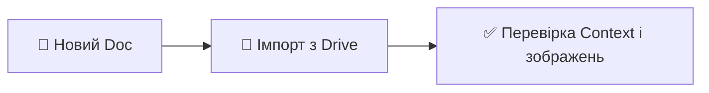
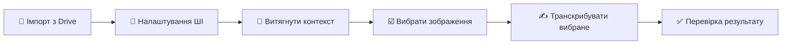

# 📖 Посібник — Додаток «Транскриптор метричних книг»

Цей додаток допомагає транскрибувати зображення метричних книг (акти народження, шлюбу, смерті) за допомогою **Google™ AI (Gemini™)**. Ви можете **імпортувати знімки з Google Drive™** (файли, які явно обираєте), додати блок **Context**, потім **транскрибувати** вибрані зображення; текст вставляється **безпосередньо під відповідним зображенням**.

## 📊 Схема роботи

**Створення документа та імпорт**

**Транскрипція (бічна панель — рекомендовано)**

## 🔄 Короткий сценарій

1. **Зберіть документ** — **Import Book from Drive Files** (рекомендовано) або вручну додайте Context і зображення.
2. **Шаблон** — якщо джерело не греко-католицькі метричні книги Галичини, відкрийте **Select Template** і оберіть профіль (наприклад, російська православна метрична книга).
3. **Транскрипція** — бічна панель для пакету або одне зображення через меню **Transcribe Image**.
4. **Налаштування** — **Extensions** → **GeneaScript** → **Setup AI** або кнопка в бічній панелі.
5. **Контекст з обкладинки** — **Extract Context from Cover Image** (меню) або **Extract Context from Selected Image** (бічна панель, одне зображення).

### Мова інтерфейсу

Доступні **англійська**, **українська**, **російська**. За замовчуванням — мова облікового запису Google. Перевизначення: **Setup AI** або **Settings** → **Interface language** (**Auto**, **English**, **Українська**, **Русский**). Заголовок **Context** у документі не перекладається — так працює авто-виявлення контексту.

Меню **Extensions** → **GeneaScript**: **Open Sidebar**, **Transcribe Image**, **Import Book from Drive Files**, **Extract Context from Cover Image**, **Select Template**, **Setup AI**, **Help / User Guide**, **Report an issue**.

## 📁 Імпорт з Google Drive (рекомендовано)

1. Відкрийте Google Doc.
2. **Extensions** → **GeneaScript** → **Import Book from Drive Files**.
3. У **Google Picker** стартує папка батьківського документа (якщо документ у Drive).
4. Вкладки **Images** / **Folders**, пошук, **до 30 зображень** (JPEG, PNG, WebP), **Select**.
5. Додається розділ **Context** (зразок з жирними мітками — відредагуйте), для кожного файлу: **Heading 2**, **Source Image Link**, зображення, розрив сторінки.

Після імпорту з’явиться підсумок (скільки додано / пропущено). Доступ лише до обраних файлів (`drive.file`).

## 📄 Структура документа (вручну)

1. **Context** — під заголовком опишіть архів, опис документа, діапазон дат, села, прізвища. Увесь текст під «Context» йде в модель.
2. **Зображення** — вставте скани під Context (Insert → Image).

## 📂 Бічна панель (пакетна транскрипція)

1. **Open Sidebar** або іконка доповнення.
2. Порядок дій: імпорт, **Setup AI**, витяг контексту, список зображень, **Transcribe Selected**.
3. Позначки: зелена галочка — вже є транскрипція; виберіть один або кілька пунктів.
4. **Stop** зупиняє пакет після поточного зображення.
5. Помилки — червоний хрестик (наведіть для тексту); попередження — можлива обрізка `MAX_TOKENS`.

## 🧾 Витяг контексту з титульної сторінки

Після імпорту: меню **Extract Context from Cover Image** або бічна панель з **одним** вибраним зображенням → **Extract** → перевірка полів → **Apply Context**.

## 📋 Галерея шаблонів

**Select Template** (меню або кнопка шаблону в бічній панелі). Доступні профілі, зокрема **Galician Greek Catholic** та **Russian Imperial Orthodox**. **Review Template** показує вкладки Context (живий текст з документа), Role, Columns, Output, Instructions. Шаблон зберігається **на документ**. Нові транскрипції використовують обраний шаблон.

### Власні шаблони (v1.4+)

Ви можете створювати **персональні шаблони** транскрибування на основі офіційних або з нуля. Кожен шаблон має секції: **Роль**, **Вхідна структура**, **Формат виводу**, **Інструкції** та **Контекст за замовчуванням**.

**Створення:**
1. Відкрийте **Галерею шаблонів** → прокрутіть до **Мої шаблони**.
2. **Створити з шаблону** — клонує офіційний шаблон. **Створити порожній** — порожній шаблон зі стартовими заготовками.
3. У редакторі заповніть **Назву**, **Опис** і налаштуйте секції через вкладки.
4. Для шаблонів на основі батьківського є кнопка **Скинути** для повернення до оригіналу.
5. **Зберегти** → шаблон з'явиться в галереї.

**Керування:** кнопки **Редагувати**, **Дублювати**, **Експортувати в документ**, **Видалити** на картці шаблону. Експорт робить шаблон доступним для колег у цьому документі (позначка «Shared»). До **5 шаблонів** на акаунт.

## ✍️ Одне зображення (меню)

1. Клацніть **по зображенню** (рамка виділення).
2. **Transcribe Image**.
3. Перший запуск — діалог ключа API та моделі ([Google AI Studio](https://aistudio.google.com/api-keys)), **Save & Continue**.
4. Дочекайтесь завершення; текст з’явиться **під зображенням**.
5. Перевірте **Quality Metrics** (сині) та **Assessment** (червоні).

**Setup AI** — зміна ключа, моделі, суворості, довжини виводу, режиму міркування.

## 📝 Формат результату

Заголовок сторінки, записи абзацами (адреса, імена, нотатки), метрики якості, оцінка, потім **підсумки мовами** (російська, українська, латиниця, англійська) списком.

## 💡 Поради

- Чим точніший **Context**, тим краще нормалізація імен.
- Якісні скани та обрізка зайвого поля покращують результат.
- Для кількох сторінок зручніша бічна панель.

## 🔧 Усунення несправностей

| Проблема | Що робити |
|----------|-----------|
| Виберіть одне зображення | Клацніть по зображенні та повторіть транскрипцію. |
| Немає доступу до файлів | Файли мають бути ваші або надані вам; повторно авторизуйтеся. |
| Немає зображень у виборі | Лише JPEG/PNG/WebP. |
| Діалог ключа API | Створіть ключ у AI Studio, збережіть у **Setup AI**. Деталі — [INSTALLATION.html](INSTALLATION.html). |
| 429 / квота | Перевірте тариф Gemini; змініть модель у **Setup AI**. |
| Таймаут (~60 с) | Спробуйте ще раз або менше зображення. |
| Бічна панель: немає зображень | Імпортуйте або вставте зображення, **Refresh**. |
| Червоний хрестик у списку | Наведіть курсор; часто мережа або квота; повторіть пізніше. |

Повна інструкція з установки: [INSTALLATION.html](INSTALLATION.html).
