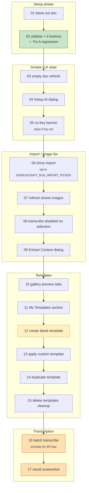

# E2E Suite Overview

All 17 tests run **serially** (`test.describe.configure({ mode: 'serial' })`). State (doc content, saved key, custom templates) carries between tests — later tests depend on earlier ones.

## High-level test flow

## Dependencies & skip conditions

| Test | Depends on | Skip condition |
|---|---|---|
| 01 | — | — |
| 02 | Doc loads | — |
| 03 | 01 (empty doc) | — |
| 04 | 02 | — |
| 05 | 02 | Account already has API key |
| 06 | 02 | `GENEASCRIPT_RUN_IMPORT_PICKER` ≠ `1` |
| 07 | Images exist in doc | — (would fail silently) |
| 08 | 07 | — |
| 09 | 07 | — |
| 10 | 02 | — |
| 11 | 02 | — |
| 12 | 02 | — |
| 13 | **12** — needs custom template | — |
| 14 | **12** | — |
| 15 | **12** (safe if nothing to delete) | — |
| 16 | 07 (images to transcribe) | No API key AND user declined interactive prompt |
| 17 | 16 | 16 was skipped |

## Test categories

| Category | Tests | Purpose |
|---|---|---|
| **Setup / teardown** | 01, 15 | Start clean, clean up |
| **UI smoke** | 02, 03, 04, 08, 10, 11 | Buttons render, dialogs open |
| **Guarded states** | 05 | Disabled/banner states when unconfigured |
| **User flows** | 06, 07, 09 | Import, refresh, extract |
| **Custom templates** | 12, 13, 14 | CRUD round-trip |
| **Full transcription** | 16, 17 | End-to-end, costs a Gemini call |

## Runtime

Full suite currently takes **~9.8 minutes** (16 tests × ~40 s each + #16 up to 8 min).

See `project/bugs/2026-04-25-e2e-optimization.md` for proposed optimizations (share doc page across tests, replace arbitrary `waitForTimeout`s) targeting 8–12 min.

## Fixes proven by this suite

| Release | Fix | Test |
|---|---|---|
| v1.4.0 | Tab isolation in custom-template editor | #12 (asserts Role ≠ Output Format) |
| v1.4.0 | Sidebar template label polls after Apply | #13 (asserts label update) |
| v1.4.3 | `openSidebarFromCard` returns valid value | #02 (rail-icon path) |
