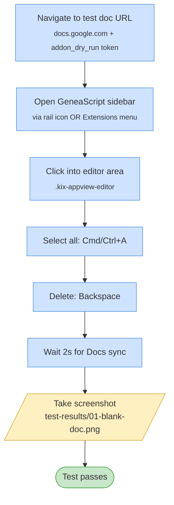

# Test 01 — Blank out test document

🎯 **Goal:** Start every full-suite run from a known-empty document so later tests aren't affected by leftover content.

## Acceptance criteria

| # | Check | Current coverage |
|---|---|---|
| 1 | Test doc loads within 120 s | ✅ via `openGeneascriptSidebar` timeout |
| 2 | Sidebar iframe finds `[data-testid="geneascript-import"]` | ✅ implicit |
| 3 | Editor is clickable (not blocked by overlays) | ✅ click succeeds |
| 4 | Screenshot is written | ✅ |

## Gaps / proposed improvements

- ⚠️ **No assertion the doc is actually empty** after the clear. A page-level check like `expect(await page.locator('.kix-canvas-tile-content').textContent()).toBe('')` would confirm the operation succeeded.
