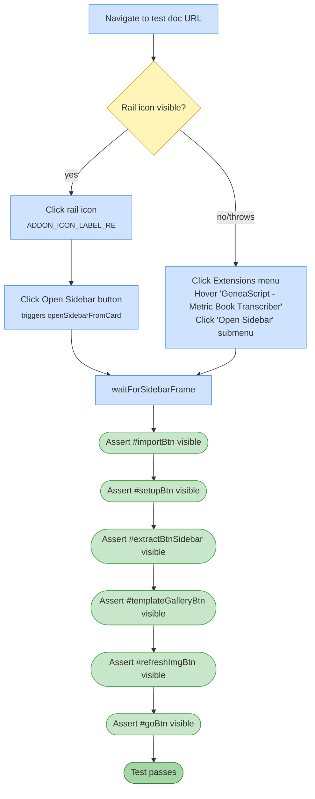

# Test 02 — Open card, sidebar, core controls

🎯 **Goal:** Smoke-test that the add-on menu → homepage card → sidebar pipeline produces a usable sidebar with all six core buttons.

> This is the critical **Fix A** regression test — it exercises `openSidebarFromCard` via the right-rail icon path.

## Acceptance criteria

| # | Check | Current coverage |
|---|---|---|
| 1 | Sidebar opens within 120 s via EITHER rail-card OR menu path | ✅ fallback |
| 2 | All 6 action buttons visible and focusable | ✅ |
| 3 | No platform error logged for `openSidebarFromCard` | ❌ Not verified from the test side |

## Gaps / proposed improvements

- ⚠️ **No check that `openSidebarFromCard` didn't log a platform error** — the bug fixed in v1.4.3 was invisible to users but showed 23 ERROR entries/week in GCP logs. Could be verified by inspecting `page.on('console')` or requesting Apps Script execution logs after the test.
- 💡 Optional: assert `#footer` text matches current version (fast early-warning if `clasp push` didn't take).
