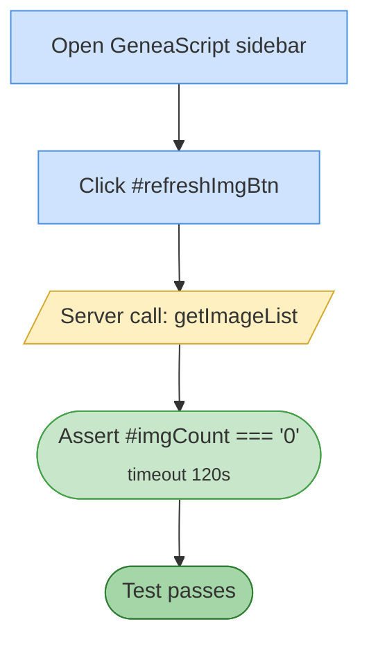

# Test 03 — Empty doc: no images for refresh

🎯 **Goal:** After blanking the doc, verify Refresh correctly reports zero images and doesn't show stale state.

## Acceptance criteria

| # | Check | Current coverage |
|---|---|---|
| 1 | Refresh triggers `getImageList` | ✅ implicit |
| 2 | Count settles at "0" within 120 s | ✅ |

## Gaps / proposed improvements

- ⚠️ **Redundant with #1** — if #1 successfully blanked the doc and #2 opened the sidebar, the count is trivially zero. Considered optional smoke-coverage; could be merged into #1 or dropped.
- 💡 Could assert the empty-state message text renders (`sidebarEmptyState`), proving the UI branch triggers.
