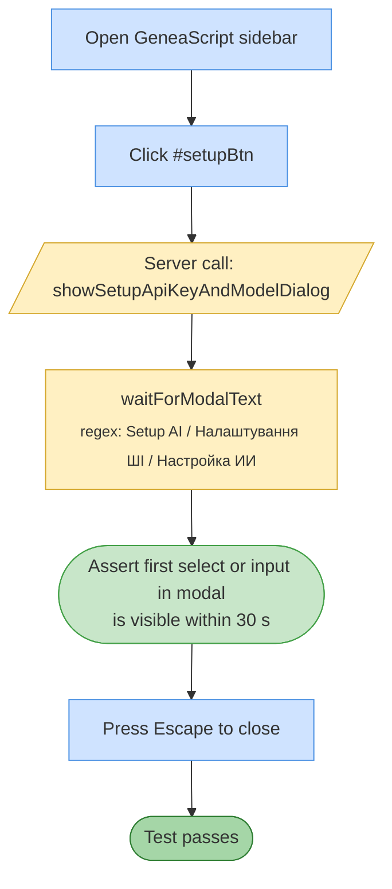

# Test 04 — Setup AI dialog

🎯 **Goal:** Verify the Setup AI modal opens cleanly with its form fields reachable.

## Acceptance criteria

| # | Check | Current coverage |
|---|---|---|
| 1 | Modal with locale-aware title appears | ✅ |
| 2 | Modal contains at least one select or input | ✅ |
| 3 | Modal closes on Escape | ✅ implicit |

## Gaps / proposed improvements

- ⚠️ **Doesn't test save flow.** Saving a key is only tested in #16 (indirectly). If the Setup save handler breaks (e.g. dialog wiring regression), it's missed here.
- 💡 Could assert each known field by ID: `#apiKey`, `#modelId`, `#temperature`, `#maxOutputTokens`. Would catch schema drift.
