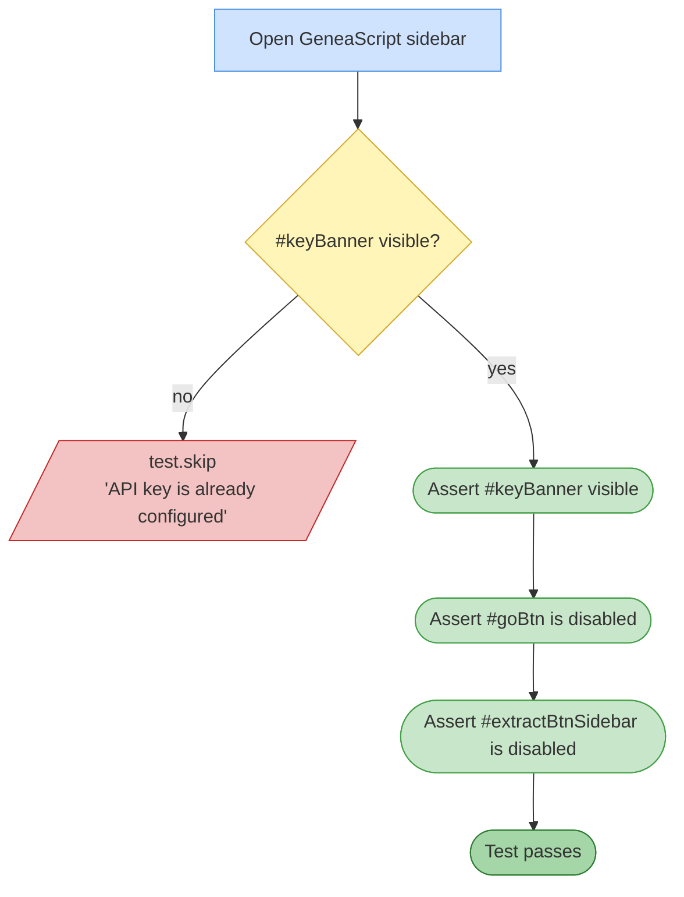

# Test 05 — No API key banner

🎯 **Goal:** When no Gemini API key is configured, the yellow "Set up your API key" banner shows and Transcribe/Extract buttons are disabled.

## Acceptance criteria

| # | Check | Current coverage |
|---|---|---|
| 1 | If no key is set — banner visible | ✅ |
| 2 | If no key is set — Transcribe button disabled | ✅ |
| 3 | If no key is set — Extract button disabled | ✅ |
| 4 | Skips cleanly when key IS set | ✅ |

## Gaps / proposed improvements

- ℹ️ This test is **inherently only informative on first setup**. Once the test account has a saved key, every run skips this.
- ℹ️ The reverse case ("banner hides after Setup save") is **intentionally not tested here** per product owner direction — Fix 4b was declined.
