# Test 06 — Import images from Drive

🎯 **Goal:** Execute the full Drive picker → import pipeline end-to-end: pick 6 images from the test folder, insert them into the document, verify they appear in the sidebar image list.

> **Gated:** runs only when `GENEASCRIPT_RUN_IMPORT_PICKER=1`. Fragile (uses hardcoded pixel coordinates), so opt-in.

```mermaid
flowchart TD
    A[Open sidebar]
    Z{GENEASCRIPT_RUN_IMPORT_PICKER=1?}
    SK[/test.skip/]
    B[Click #importBtn]
    C[Wait for picker dialog<br/>disableScrim]
    D[findPickerFrame<br/><sub>list view / doclist-grid iframe</sub>]
    E[Double-click folder 'ДАТО ф487...']
    F[CDP click: List View toggle<br/><sub>viewport 1053,235</sub>]
    G[CDP click: Name column header<br/><sub>sort ascending</sub>]
    H[CDP click file #1<br/><sub>cover-title-page.jpg</sub>]
    I[CDP shift+click file #6<br/><sub>image00005.jpg</sub>]
    J[CDP click Select button<br/><sub>185,638</sub>]
    K[Wait for 'Importing...' dialog]
    L[Click OK in confirm alert<br/><sub>multi-strategy: page button / CDP / all frames</sub>]
    M[Poll up to 3 min:<br/>refresh button clickable → dialog closed]
    N[Reload page]
    O[Re-open sidebar]
    P[Click Refresh]
    Q([Assert first checkbox visible])
    R([Assert image count ≥ 6])
    S([Take doc screenshot])
    T([Test passes])

    A --> Z
    Z -- no --> SK
    Z -- yes --> B --> C --> D --> E --> F --> G --> H --> I --> J --> K --> L --> M --> N --> O --> P --> Q --> R --> S --> T

    style A fill:#cfe3ff,stroke:#4a90e2
    style B fill:#cfe3ff,stroke:#4a90e2
    style C fill:#cfe3ff,stroke:#4a90e2
    style E fill:#cfe3ff,stroke:#4a90e2
    style F fill:#cfe3ff,stroke:#4a90e2
    style G fill:#cfe3ff,stroke:#4a90e2
    style H fill:#cfe3ff,stroke:#4a90e2
    style I fill:#cfe3ff,stroke:#4a90e2
    style J fill:#cfe3ff,stroke:#4a90e2
    style L fill:#cfe3ff,stroke:#4a90e2
    style N fill:#cfe3ff,stroke:#4a90e2
    style O fill:#cfe3ff,stroke:#4a90e2
    style P fill:#cfe3ff,stroke:#4a90e2
    style D fill:#fff0c2,stroke:#d4a72c
    style K fill:#fff0c2,stroke:#d4a72c
    style M fill:#fff0c2,stroke:#d4a72c
    style Z fill:#fff5b8,stroke:#d4a72c
    style SK fill:#f3c2c2,stroke:#c62828
    style Q fill:#c8e6c9,stroke:#43a047
    style R fill:#c8e6c9,stroke:#43a047
    style S fill:#c8e6c9,stroke:#43a047
    style T fill:#a5d6a7,stroke:#2e7d32
```

## Acceptance criteria

| # | Check | Current coverage |
|---|---|---|
| 1 | Picker dialog opens and reveals target folder | ✅ |
| 2 | Folder navigation + list view + sort work | ✅ |
| 3 | 6 files can be range-selected | ✅ |
| 4 | Select button completes | ✅ |
| 5 | "Importing…" confirm dialog is dismissed | ✅ |
| 6 | After reload, sidebar shows ≥ 6 image checkboxes | ✅ |
| 7 | Document contains imported images | ⚠️ screenshot only — no DOM check |

## Gaps / proposed improvements

- ⚠️ **Very fragile** — depends on hardcoded viewport pixel coordinates (`1053,235`, `300,349`, `185,638` …). Any picker UI shift or viewport change breaks it.
- ⚠️ **"Document contains images" is not asserted** — only an image-count assertion in the sidebar. An image could be "listed" but not actually embedded.
- 💡 Replace pixel-coord clicks with **keyboard shortcuts**: arrow keys to navigate rows, Enter to open folder, Shift+End to select range. Much more stable.
- 💡 Could add a server-call assertion: `getImageList()` returns an array of ≥ 6 objects with valid `bodyIndex`.
