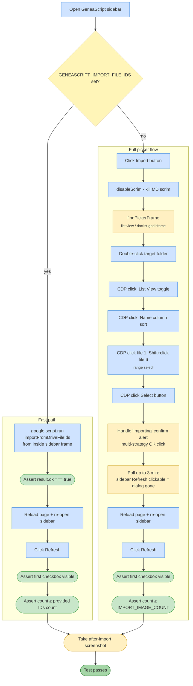

# Test 06 — Import images from Drive

🎯 **Goal:** Ensure the user can select and import multiple images from a Drive folder and they are inserted into the document + visible in the sidebar image list.

> Runs by default. Two modes:
> - **Fast path** (`GENEASCRIPT_IMPORT_FILE_IDS=id1,id2,...`): bypasses the picker and calls `importFromDriveFileIds` directly. Requires the test account to have already granted `drive.file` scope to those IDs (easiest way: run the picker manually once and note the IDs).
> - **Full picker** (when the env var is unset): drives the Google Picker iframe with DOM locators + CDP mouse events. Fragile but covers the user-visible flow.

## Acceptance criteria

| # | Check | Fast path | Full picker |
|---|---|---|---|
| 1 | Server function accepts the import request without error | ✅ | ✅ (implicit via picker) |
| 2 | Sidebar image list contains at least the expected count | ✅ | ✅ |
| 3 | Picker opens, navigates, selects, and dismisses cleanly | — | ✅ |
| 4 | Post-import reload is not corrupted | ✅ | ✅ |

## Gaps / proposed improvements

- ⚠️ **"Document contains images" is asserted via the sidebar image list, not by inspecting the document DOM directly.** An image could be listed but not actually embedded in the doc body. Could add a check: `await page.evaluate(() => document.querySelectorAll('img[src*="drive"]').length)` or similar.
- 💡 The full-picker flow still uses hardcoded viewport pixel coordinates (1053,235 / 300,349 / 185,638). Brittle. Could be replaced with keyboard navigation (arrow keys + Enter) in a follow-up.
- 💡 Could capture the `import_drive_done` OBS event from Apps Script logs and assert `addedCount === expected`.
