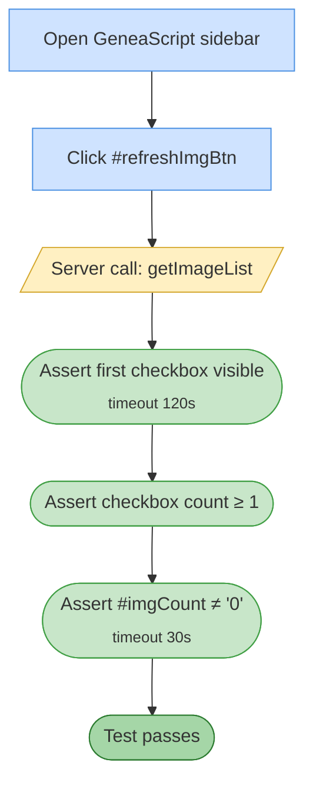

# Test 07 — Refresh image list

🎯 **Goal:** After images have been imported (either by previous test runs or by test #6), clicking Refresh populates the sidebar image list.

## Acceptance criteria

| # | Check | Current coverage |
|---|---|---|
| 1 | At least one image checkbox renders after Refresh | ✅ |
| 2 | Sidebar image counter reflects non-zero count | ✅ |

## Gaps / proposed improvements

- ⚠️ **Silent dependency on doc state** — if #6 was skipped and the doc has no pre-imported images, this test fails with a confusing timeout instead of a clear "no images to refresh" message.
- 💡 Could add pre-check `if (count === 0) test.skip(...)` with a clear message pointing to #6 or manual import.
