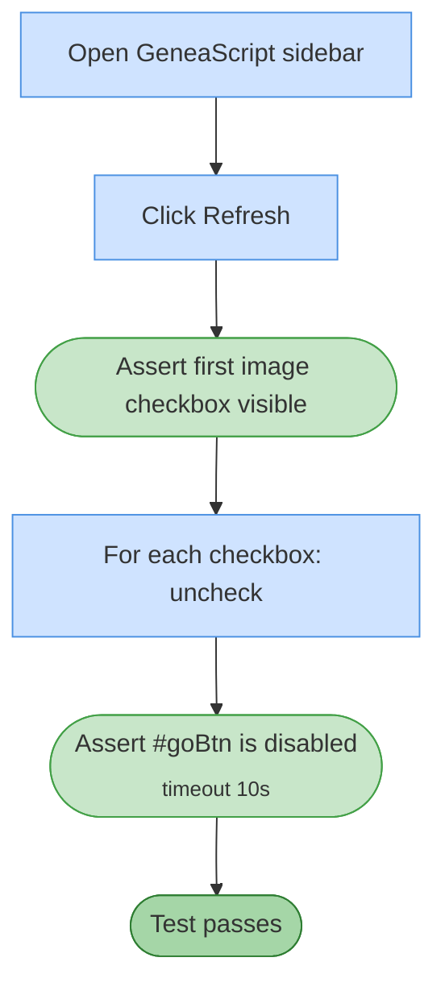

# Test 08 — No image selected: transcribe disabled

🎯 **Goal:** The Transcribe button is disabled whenever zero images are checked, even after the image list has been populated.

## Acceptance criteria

| # | Check | Current coverage |
|---|---|---|
| 1 | After explicitly unchecking all boxes, Transcribe button is disabled | ✅ |

## Gaps / proposed improvements

- 💡 Symmetric test missing: check one box → Transcribe enabled. Covered partially by #9 (Extract) but not for Transcribe specifically.
- 💡 Could also assert `#goBtn` text reflects `"▶ Transcribe"` (or localized) rather than a multi-count variant.
