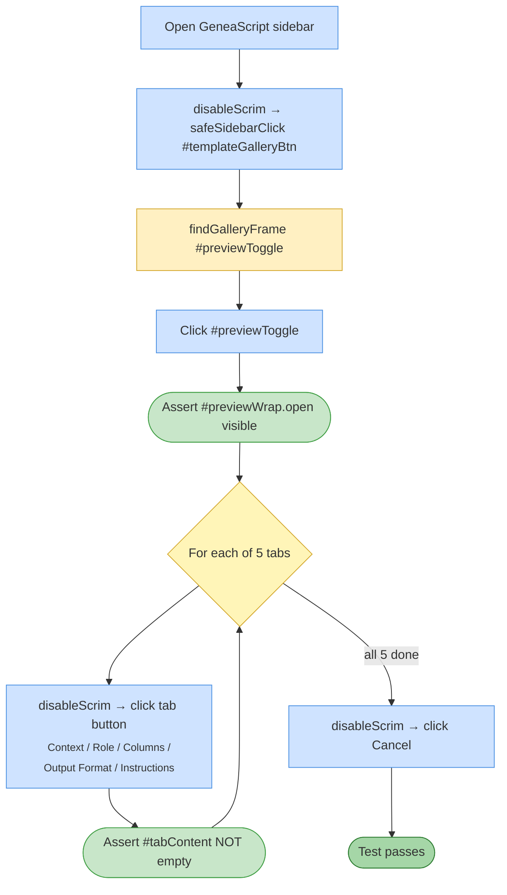

# Test 10 — Template Gallery preview tabs

🎯 **Goal:** Opening the Template Gallery reveals a preview pane that renders content for all 5 tabs (Context, Role, Columns, Output Format, Instructions).

## Acceptance criteria

| # | Check | Current coverage |
|---|---|---|
| 1 | Gallery opens with preview pane | ✅ |
| 2 | Each of 5 tabs switches and renders content | ✅ |
| 3 | Content area is not empty for any tab | ✅ |
| 4 | Cancel closes the gallery | ✅ implicit |

## Gaps / proposed improvements

- 💡 Could additionally assert tab content **differs** between tabs (proving actual tab switching, not just "stuck content"). A regression in v1.4.0 caused all tabs to share a textarea — this test would catch the next one.
