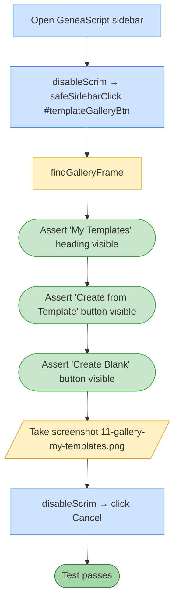

# Test 11 — Gallery shows My Templates section

🎯 **Goal:** The Template Gallery dialog contains a "My Templates" section with the two Create buttons, even when no custom templates exist yet.

## Acceptance criteria

| # | Check | Current coverage |
|---|---|---|
| 1 | "My Templates" section visible in the gallery | ✅ |
| 2 | "Create from Template" button visible | ✅ |
| 3 | "Create Blank" button visible | ✅ |

## Gaps / proposed improvements

- 💡 Should also assert the **max-5-templates limit** messaging path: if the test user already has 5 custom templates, the Create buttons should disable or show a tooltip. Requires seeding state or reusing #15 cleanup guarantees.
