# Test 12 — Create blank custom template

🎯 **Goal:** Full custom-template authoring round-trip — open editor, fill name + description + multiple tabs, verify tab isolation, save, verify new template appears in gallery.

```mermaid
flowchart TD
    A[Open GeneaScript sidebar]
    B[disableScrim → safeSidebarClick #templateGalleryBtn]
    C[findGalleryFrame]
    D[Click 'Create Blank']
    E[findEditorFrame #tplName]
    F[Fill #tplName 'E2E Test Template']
    G[Fill #tplDesc 'Automated test template for E2E']
    H[Fill #sec_role 'You are an E2E test transcription specialist.']
    I[Switch to Input Structure tab<br/>Fill #sec_inputStructure 'Test input structure content.']
    J[Switch to Output Format tab<br/>Read #sec_outputFormat value]
    K([Assert outputFormat value<br/>does NOT contain 'E2E test transcription specialist'<br/><sub>proves tabs isolated</sub>])
    L[/Take screenshot 12-editor-filled/]
    M[Click #saveBtn]
    N[findGalleryFrame - reopened]
    O([Assert 'E2E Test Template' card visible])
    P[/Take screenshot 12-gallery-with-custom/]
    Q[Click Cancel]
    R([Test passes])

    A --> B --> C --> D --> E --> F --> G --> H --> I --> J --> K --> L --> M --> N --> O --> P --> Q --> R

    style A fill:#cfe3ff,stroke:#4a90e2
    style B fill:#cfe3ff,stroke:#4a90e2
    style D fill:#cfe3ff,stroke:#4a90e2
    style F fill:#cfe3ff,stroke:#4a90e2
    style G fill:#cfe3ff,stroke:#4a90e2
    style H fill:#cfe3ff,stroke:#4a90e2
    style I fill:#cfe3ff,stroke:#4a90e2
    style J fill:#cfe3ff,stroke:#4a90e2
    style M fill:#cfe3ff,stroke:#4a90e2
    style Q fill:#cfe3ff,stroke:#4a90e2
    style C fill:#fff0c2,stroke:#d4a72c
    style E fill:#fff0c2,stroke:#d4a72c
    style N fill:#fff0c2,stroke:#d4a72c
    style L fill:#fff0c2,stroke:#d4a72c
    style P fill:#fff0c2,stroke:#d4a72c
    style K fill:#c8e6c9,stroke:#43a047
    style O fill:#c8e6c9,stroke:#43a047
    style R fill:#a5d6a7,stroke:#2e7d32
```

## Acceptance criteria

| # | Check | Current coverage |
|---|---|---|
| 1 | Create Blank opens the editor | ✅ |
| 2 | Editor fields accept input on all tabs | ✅ |
| 3 | **Tab isolation:** Output Format does NOT contain Role text (v1.4.0 regression check) | ✅ |
| 4 | Save closes editor and reopens gallery | ✅ |
| 5 | New template 'E2E Test Template' appears in the gallery | ✅ |

## Gaps / proposed improvements

- 💡 Could also assert the **description** persisted by opening the new card and reading its metadata.
- 💡 After v1.4.3's `safeSidebarClick` fix, flake caused by `[data-fb]` overlay is gone; keep an eye on re-emergence.
