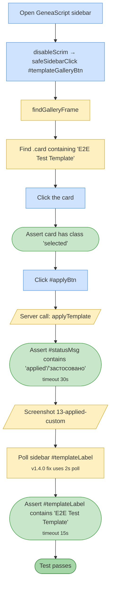

# Test 13 — Apply custom template

🎯 **Goal:** Selecting a custom template and clicking Apply persists the selection and updates the sidebar template label.

**Depends on #12** — the 'E2E Test Template' must already exist.

## Acceptance criteria

| # | Check | Current coverage |
|---|---|---|
| 1 | Clicking a custom-template card marks it `.selected` | ✅ |
| 2 | Apply succeeds and status message confirms | ✅ |
| 3 | Sidebar template label updates via polling (v1.4.0 fix) | ✅ |

## Gaps / proposed improvements

- 💡 Could verify the selected template ID is persisted to Document Properties by round-tripping through `getSelectedTemplateLabelForClient()` after a page reload.
