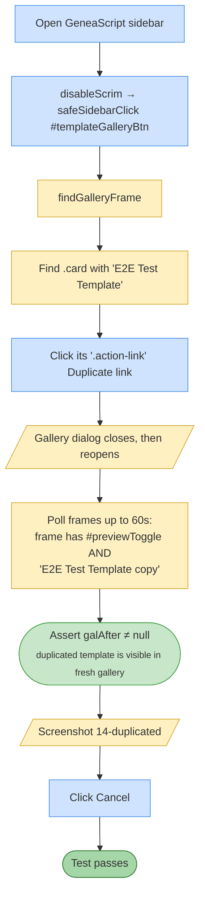

# Test 14 — Duplicate custom template

🎯 **Goal:** Clicking "Duplicate" on a custom template creates a copy with "(copy)" suffix and the new card appears in a reloaded gallery.

**Depends on #12** — 'E2E Test Template' must exist.

## Acceptance criteria

| # | Check | Current coverage |
|---|---|---|
| 1 | Duplicate action triggers gallery re-render | ✅ |
| 2 | New card labelled 'E2E Test Template (copy)' appears | ✅ |

## Gaps / proposed improvements

- 💡 Could verify the duplicate has a **distinct ID** (not the same as the source) by inspecting data attributes on the card.
- 💡 Could also check the total custom-template count increased by exactly 1.
