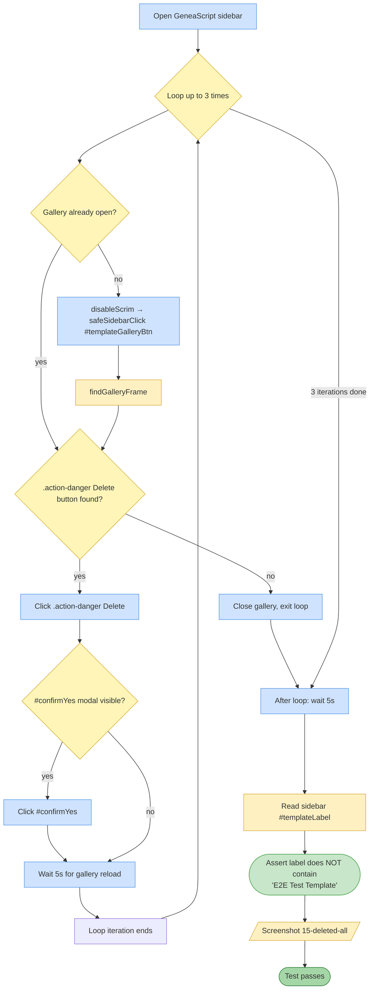

# Test 15 — Delete custom templates (cleanup)

🎯 **Goal:** Clean up after tests #12–14 by deleting every custom template created, and confirm the sidebar falls back to an OOB template label. Serves as test + cleanup.

## Acceptance criteria

| # | Check | Current coverage |
|---|---|---|
| 1 | All custom templates can be deleted iteratively | ✅ |
| 2 | Confirm modal appears and is accepted | ✅ |
| 3 | After deletion, sidebar label reverts away from 'E2E Test Template' | ✅ |

## Gaps / proposed improvements

- 💡 Final assertion could be **stronger**: instead of "not contains E2E Test Template", assert label matches an OOB template name (Galician / Russian Imperial / Generic).
- 💡 Count-based assertion: after cleanup, `action-danger` buttons count = 0 in the gallery.
