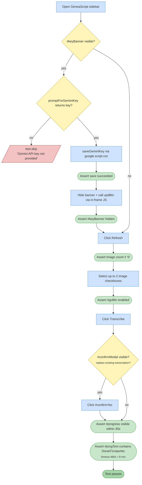

# Test 16 — Batch transcribe (needs API key)

🎯 **Goal:** End-to-end transcription flow — select images, click Transcribe, handle replace-modal if present, wait for the run to finish.

> **Interactive:** if no API key is configured and no `GEMINI_API_KEY` env var is set, prompts the test runner on stdin for a key. Cached for the process so the prompt only appears once. Press Enter without input to skip transcription tests.

## Acceptance criteria

| # | Check | Current coverage |
|---|---|---|
| 1 | If no key: prompts interactively or reads `GEMINI_API_KEY` env var | ✅ |
| 2 | Key is saved via `saveApiKeyAndModel` server call | ✅ |
| 3 | After save, banner hides and Transcribe becomes available | ✅ |
| 4 | Progress bar appears | ✅ |
| 5 | Progress text eventually shows completion message | ✅ |

## Gaps / proposed improvements

- 💡 Should additionally assert:
  - The error banner (`#errorBanner`) is **NOT** visible after a successful run (would catch regressions where `API_OVERLOADED` / `API_KEY_INVALID` banner fires incorrectly).
  - No image row shows a `.st-fail` or `.st-warn` icon (all transcriptions succeeded).
- 💡 For flake protection: also accept "done with fails" but flag the test as informational with the number of failed images.
