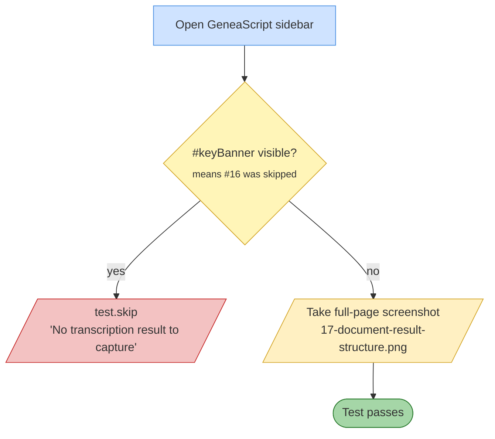

# Test 17 — Document result structure after transcription

🎯 **Goal:** Capture a full-page screenshot of the document after transcription for visual / human review.

## Acceptance criteria

| # | Check | Current coverage |
|---|---|---|
| 1 | If #16 didn't run, skip rather than capture empty screenshot | ✅ |
| 2 | Screenshot is written | ✅ |

## Gaps / proposed improvements

- ⚠️ **Not really a test** — no assertions on content. Current value is a build artifact + visual QA reference.
- 💡 Could assert doc body contains:
  - Expected per-record markers (year header, names, languages)
  - Archive reference string from the Context section
  - No raw API error text ("HTTP 503" etc.) in the document body
  - Inserted paragraph count matches number of selected images × expected insertions
- 💡 Could compare against a baseline screenshot (visual regression) to catch layout changes.
