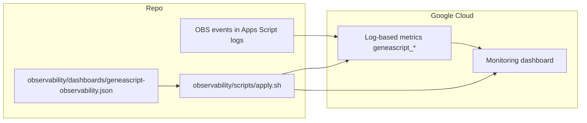

# GeneaScript Observability as Code

This folder stores Google Cloud observability configuration so dashboards/metrics can be versioned in git and reapplied consistently.

## Scope

- **Telemetry source:** `addon/Code.gs` + `addon/Observability.gs`
- **Observability assets:** `observability/scripts/apply.sh` and `observability/dashboards/geneascript-observability.json`
- **Spec:** `project/SPEC-6-OBSERVABILITY.md`

## Contents

- `dashboards/geneascript-observability.json` - Monitoring dashboard config
- `scripts/apply.sh` - Upserts log-based metrics and dashboard

## Metrics currently managed

| Operation | Metric Name | Description |
|---|---|---|
| Transcribe | `geneascript_transcribe_images_count` | Count of successful image transcription completions. |
| Import | `geneascript_import_runs_count` | Count of completed import runs. |
| Reliability | `geneascript_errors_count` | Count of events logged with `status=error`. |
| Transcribe | `geneascript_prompt_tokens` | Distribution of prompt token usage per transcription request. |
| Transcribe | `geneascript_output_tokens` | Distribution of output token usage per transcription response. |
| Transcribe | `geneascript_total_tokens` | Distribution of total token usage per transcription response. |
| Transcribe | `geneascript_estimated_cost_usd` | Distribution of estimated USD cost per image from prompt/output tokens (groupable by model). |
| User activity | `geneascript_user_activity_count` | Counter metric used for daily/monthly active user approximations (anonymized user key label). |
| Transcribe | `geneascript_transcribe_latency_ms` | Distribution of end-to-end transcription latency in milliseconds. |
| Transcribe | `geneascript_image_bytes` | Distribution of input image sizes for transcription requests. |
| Import | `geneascript_images_imported_count` | Distribution of images imported per completed import run (`addedCount`). |
| Import | `geneascript_import_image_latency_ms` | Distribution of per-image import latency in milliseconds. |

## Dashboard provisioning flow



## Prerequisites

- `gcloud` CLI installed and authenticated
- Permissions for:
  - `logging.logMetrics.create`
  - `logging.logMetrics.update`
  - `monitoring.dashboards.create`
  - `monitoring.dashboards.update`
- Current project selected in gcloud:
  - `gcloud config set project <YOUR_PROJECT_ID>`

## Apply

From repo root:

```bash
bash observability/scripts/apply.sh
```

The script will:

1. Upsert log-based metrics (usage, tokens, latency, image size, import counts, user-level labels)
2. Upsert dashboard config

## Verify in Google Cloud

1. **Logging -> Log-based metrics:** confirm all `geneascript_*` metrics exist.
2. **Metrics Explorer:** query `logging/user/geneascript_transcribe_images_count`.
3. **Dashboards:** open `GeneaScript Observability`.

## Notes for current logging format

Current app logs are emitted as `OBS:{...}` in `jsonPayload.message` for Apps Script console logs.
Metrics in this folder extract values with regex from `jsonPayload.message`.

If/when logging moves to native `jsonPayload`, update metric extractors in `apply.sh` to use direct field extraction.
