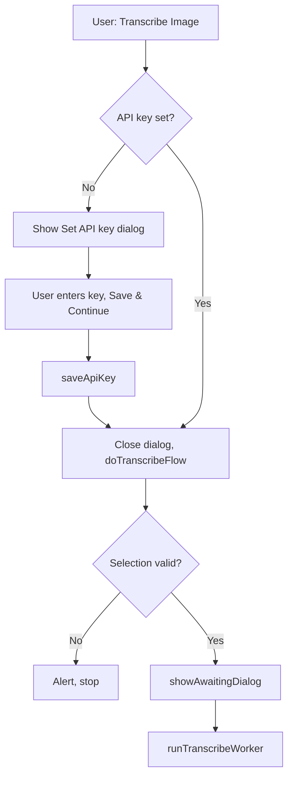

# Project: Set API Key in Transcribe Flow

## 1. Overview

**Feature:** In-flow API key setup (first step of Transcribe)
**Goal:** Allow users to set the API key when it is not yet configured, as the first step of the Transcribe Image flow, instead of requiring them to open Project Settings → Script properties beforehand. The add-on shows a modal with brief instructions and a link to get a key (Google AI Studio), then continues the transcribe flow after the key is saved.

## 2. User Flow

1. User opens a document and runs **Extensions → Metric Book Transcriber → Transcribe Image** (with or without an image selected).
2. **If the API key is not set:** A modal dialog appears:
   - Short instructions: the add-on needs a Google AI (Gemini) API key; user can get a free key at Google AI Studio (sign in, then Create API key).
   - Clickable link: [Google AI Studio – API keys](https://aistudio.google.com/app/apikey).
   - Text input for the API key and a **Save & Continue** button.
3. User obtains a key (e.g. via the link), pastes it, and clicks **Save & Continue**.
4. The key is saved to Script Properties (`GEMINI_API_KEY`), the dialog closes, and the transcribe flow continues (selection check → “Awaiting response from Gemini API…” → transcription).
5. **If the API key is already set:** The dialog is skipped; the flow goes directly to selection check and transcription as today.

## 3. Technical Requirements

### 3.1. Backend (`Code.gs`)

- **`saveApiKey(key)`**  
  - Trim `key`. If empty, return `{ ok: false, message: '...' }`.  
  - Otherwise: `PropertiesService.getScriptProperties().setProperty(API_KEY_PROPERTY, key)` and return `{ ok: true }`.  
  - No server-side validation of the key against the API.

- **`doTranscribeFlow()`**  
  - Contains all logic after the API-key check: get document and UI, validate selection (exactly one image), build context and prompt, call `showAwaitingDialog(ui)`.  
  - Must be invokable via `google.script.run.doTranscribeFlow()` from the key dialog’s success handler.

- **`transcribeSelectedImage()` (menu entry)**  
  - Read `GEMINI_API_KEY` from Script Properties.  
  - If missing or empty: show the “Set API key” HTML modal; on Save success (client-side), close dialog and call `google.script.run.doTranscribeFlow()`.  
  - If key is set: call `doTranscribeFlow()` directly.

### 3.2. Set API Key Dialog (HTML)

- Modal built with `HtmlService.createHtmlOutput(...)` and `ui.showModalDialog(...)` (inline HTML in `Code.gs`, no separate .html file).
- Content:
  - Instructions text and link: `https://aistudio.google.com/app/apikey` (e.g. “Get a free key at Google AI Studio (sign in, then Create API key). Paste your key below and click Save & Continue.”).
  - Single text input for the API key.
  - “Save & Continue” button that calls `google.script.run.withSuccessHandler(...).withFailureHandler(...).saveApiKey(key)`; on success, close dialog and call `google.script.run.doTranscribeFlow()`.
- Optional: small status area to show validation or server errors without closing the dialog.

### 3.3. Worker

- Keep the existing check in `runTranscribeWorker()` for a missing key and return a clear error (defensive).

### 3.4. Storage and Security

- Key stored in **User Properties** (private per Google account); property name `GEMINI_API_KEY`. Each user's key is isolated — other users of the same published add-on cannot see or consume another user's API quota.
- No new scopes or dependencies.

## 4. Documentation and Changelog

- **README.md:** In Requirements, state that the key can be set the first time you run Transcribe Image (instructions and link in the add-on) or in Script properties.
- **docs/INSTALLATION.md:** Prerequisites and per-option note that key can be set in-app on first transcribe; troubleshooting updated for “Please set your Google AI API key”.
- **docs/USER_GUIDE.md:** Transcribe section and troubleshooting updated to mention the in-flow key dialog and link.
- **docs/DESIGN.md:** Section 8.1 (API key) updated: key can be set in transcribe flow (first step) or via Script properties.
- **CHANGELOG.md:** New entry describing the feature (in-flow key setup with instructions and link to Google AI Studio).

## 5. Flow Diagram

## 6. Files to Touch

| File | Action |
|------|--------|
| `addon/Code.gs` | Add `saveApiKey()`, “Set API key” dialog and wiring in `transcribeSelectedImage()`, extract `doTranscribeFlow()`. |
| `README.md` | Update requirements for API key. |
| `docs/INSTALLATION.md` | Prerequisites, per-option note, troubleshooting. |
| `docs/USER_GUIDE.md` | Transcribe steps, troubleshooting. |
| `docs/DESIGN.md` | Section 8.1. |
| `CHANGELOG.md` | New entry. |
