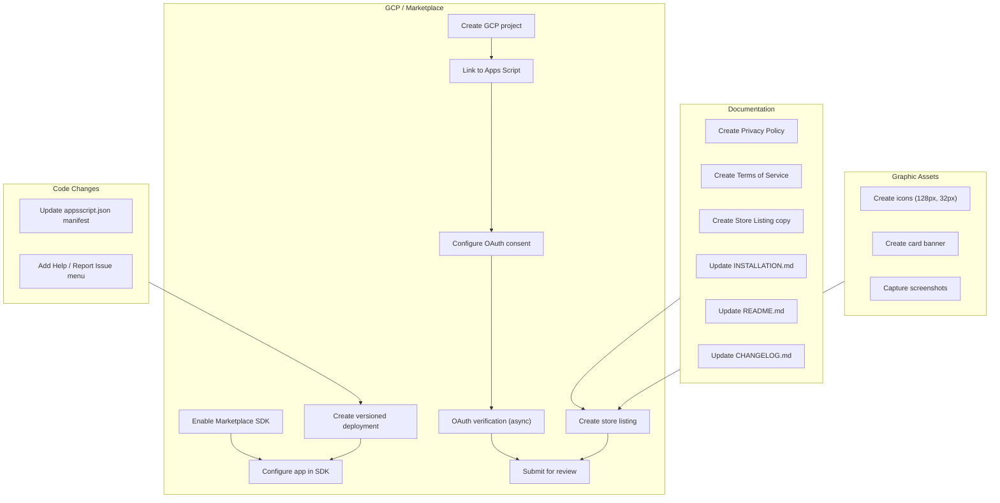

# Project: Publish to Google Workspace Marketplace

## 1. Overview

**Feature:** Prepare and publish the Metric Book Transcriber add-on to the Google Workspace Marketplace so end users can install it with one click.

**Goal:** Move from the current development-only distribution (Test deployments, container-bound scripts, manual clasp push) to a publicly listed Editor add-on on the Google Workspace Marketplace. End users should be able to search for "Metric Book Transcriber," install it, and start using it in any Google Doc without touching code.

## 2. Scope

### 2.1 Code and Manifest Changes

| Change | File | Description |
|--------|------|-------------|
| Add `addOns` block | `addon/appsscript.json` | Add `addOns.common` (name, logoUrl) and `addOns.docs` sections for proper Editor add-on registration. |
| Help menu items | `addon/Code.gs` | Add "Help / User Guide" and "Report an issue" items to the add-on menu with separator. Add `showHelp()` and `reportIssue()` handler functions that open GitHub URLs. |

### 2.2 Documentation

| Document | Action |
|----------|--------|
| `docs/PRIVACY_POLICY.md` | **New.** Privacy policy covering data access (API key, document content, images), storage (User Properties), third-party API (Gemini), no analytics/tracking. Required for Marketplace listing. |
| `docs/en/TERMS_OF_SERVICE.md` | **New.** Terms of service: provided as-is, no warranty, user responsible for API key/costs, open-source. Required for Marketplace listing. |
| `docs/STORE_LISTING.md` | **New.** Drafted store listing copy (app name, short/detailed descriptions, category, support links, graphic assets checklist) for copy-paste into the Marketplace SDK console. |
| `docs/INSTALLATION.md` | **Updated.** Added "Option 0: Install from Marketplace" as the recommended path for end users. Updated installation path diagram and logo section. |
| `docs/USER_GUIDE.md` | No changes needed (already complete). |
| `README.md` | **Updated.** Added Marketplace install section, fixed broken screenshot reference, added links to Privacy Policy and Terms of Service. |
| `CHANGELOG.md` | **Updated.** Added v0.3 entry for Marketplace preparation changes. |

### 2.3 Graphic Assets (Manual — Not in Repo Yet)

| Asset | Specification | Status |
|-------|--------------|--------|
| Logo icon (128x128 px) | Square, color, transparent background, PNG | TODO — commit to `addon/img/` |
| Logo icon (32x32 px) | Same style as 128px | TODO — commit to `addon/img/` |
| Card banner (220x140 px) | For Marketplace listing card | TODO |
| Screenshot(s) (1280x800 px) | At least 1, ideally 3, showing add-on in Google Docs | TODO |
| User guide screenshots | Step1–Step4 JPGs referenced in USER_GUIDE.md | TODO (or remove broken refs) |

### 2.4 Manual GCP / Marketplace Steps

These cannot be automated and must be performed in the Google Cloud Console and Apps Script editor:

1. **Create a standard GCP project** — [console.cloud.google.com](https://console.cloud.google.com/) → New Project → name "Metric Book Transcriber."
2. **Link GCP project to Apps Script** — Apps Script Project Settings → Change project → enter GCP project number.
3. **Configure OAuth consent screen** — APIs & Services → OAuth consent screen → External → add all 4 scopes → add test users → set to Production when ready.
4. **Submit for OAuth verification** — Required because `drive.readonly` and `script.external_request` are sensitive scopes. Prepare a demo video. Can take days/weeks.
5. **Enable Google Workspace Marketplace SDK** — In GCP Console, enable the SDK (not the API).
6. **Configure the Marketplace SDK** — App Configuration page: visibility (Public or Private — permanent choice), installation settings (Individual + Admin Install), app integration (Editor add-on with script ID and version number), OAuth scopes, developer info.
7. **Create a versioned deployment** — In Apps Script, create a version (not a deployment) and record the version number.
8. **Create the store listing** — Marketplace SDK → Store Listing → fill in using `docs/STORE_LISTING.md` copy, upload icons/banner/screenshots, add support links (Terms, Privacy, Support, Help).
9. **Submit for app review** — After OAuth verification is complete, submit the store listing for Google's review. Typically takes several days.

## 3. Flow Diagram

## 4. Files Touched

| File | Action |
|------|--------|
| `addon/appsscript.json` | Added `addOns` block. |
| `addon/Code.gs` | Added Help and Report Issue menu items and handlers. |
| `docs/PRIVACY_POLICY.md` | New file. |
| `docs/en/TERMS_OF_SERVICE.md` | New file. |
| `docs/STORE_LISTING.md` | New file. |
| `docs/INSTALLATION.md` | Added Marketplace option, updated diagram and logo section. |
| `README.md` | Added Marketplace install, policy links, fixed broken image ref. |
| `CHANGELOG.md` | Added v0.3 entry. |
| `project/SPEC-4-PUBLISH-MARKETPLACE.md` | This file. |

## 5. Success Criteria

- The add-on is listed on the Google Workspace Marketplace and searchable by name.
- End users can install it from the Marketplace with one click.
- After installation, the menu appears in any Google Doc under **Extensions → Metric Book Transcriber**.
- The Privacy Policy, Terms of Service, and support links are accessible from the Marketplace listing.
- The add-on passes Google's app review without rejection.

## 6. Risks and Mitigations

| Risk | Mitigation |
|------|-----------|
| OAuth verification delay (days/weeks) | Start the verification process early; the demo video from existing YouTube demo can be reused or re-recorded. |
| Rejection for missing screenshots | Capture real screenshots from a running add-on before submitting. |
| `drive.readonly` scope flagged as overly broad | This scope is needed for the Import from Drive feature; document the justification clearly in OAuth verification. |
| Logo not hosted at a public HTTPS URL | Use GitHub raw URL after committing the icon to the repo. |
| Visibility choice is permanent | Decide Public vs Private carefully before saving. Public is recommended for open-source distribution. |
