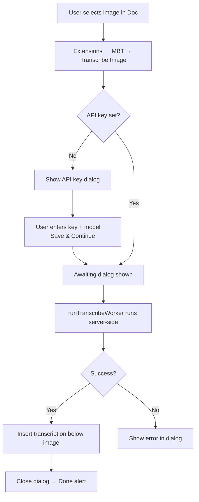
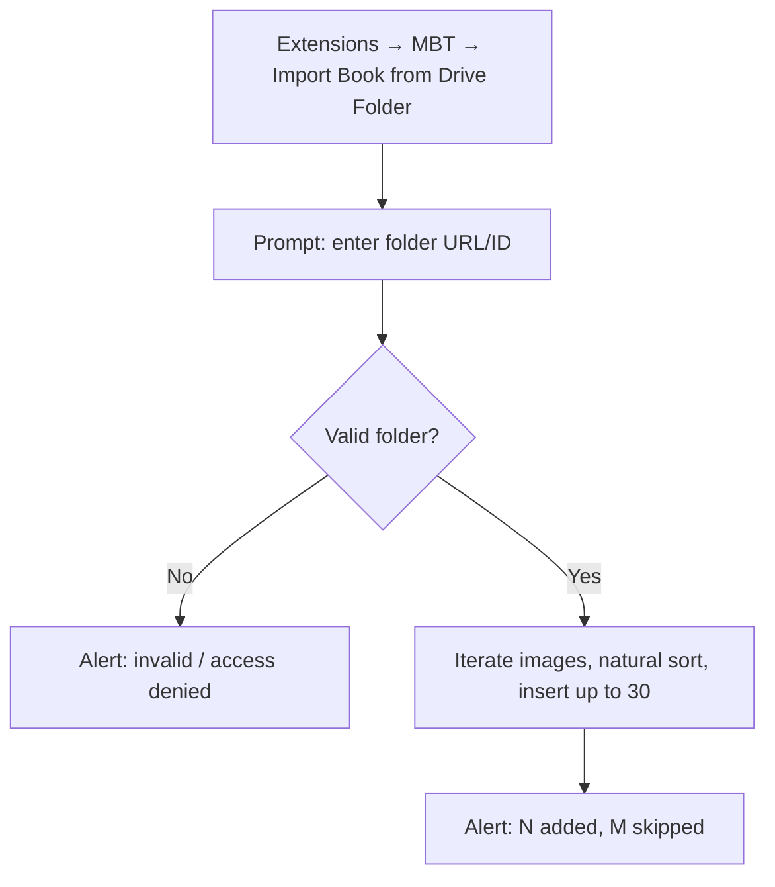
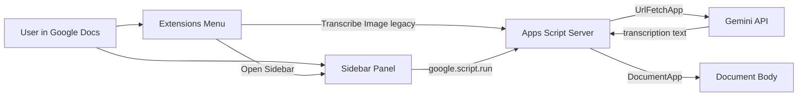
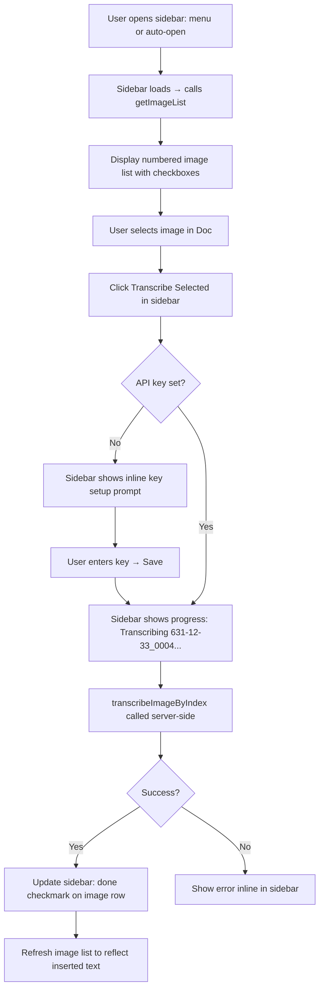
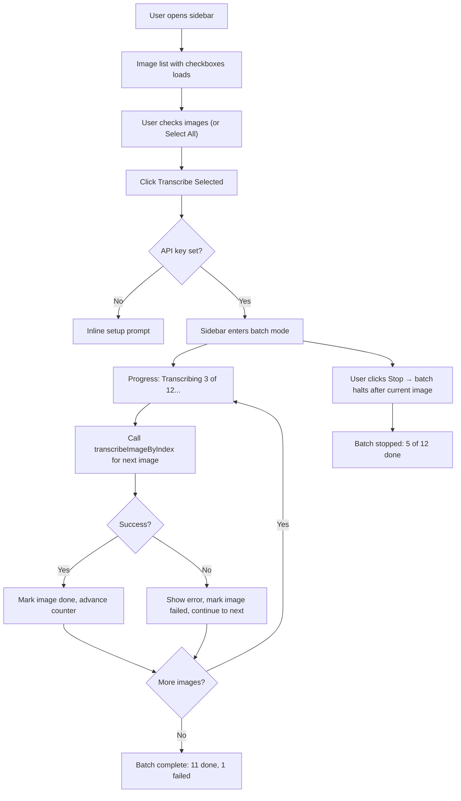
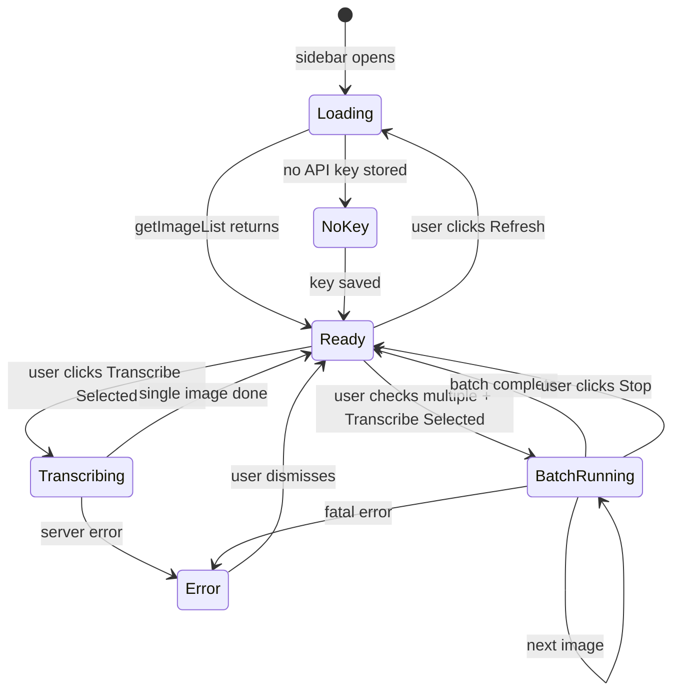
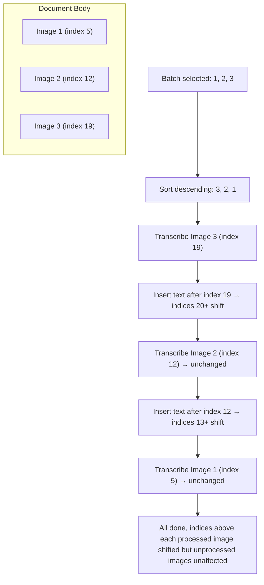
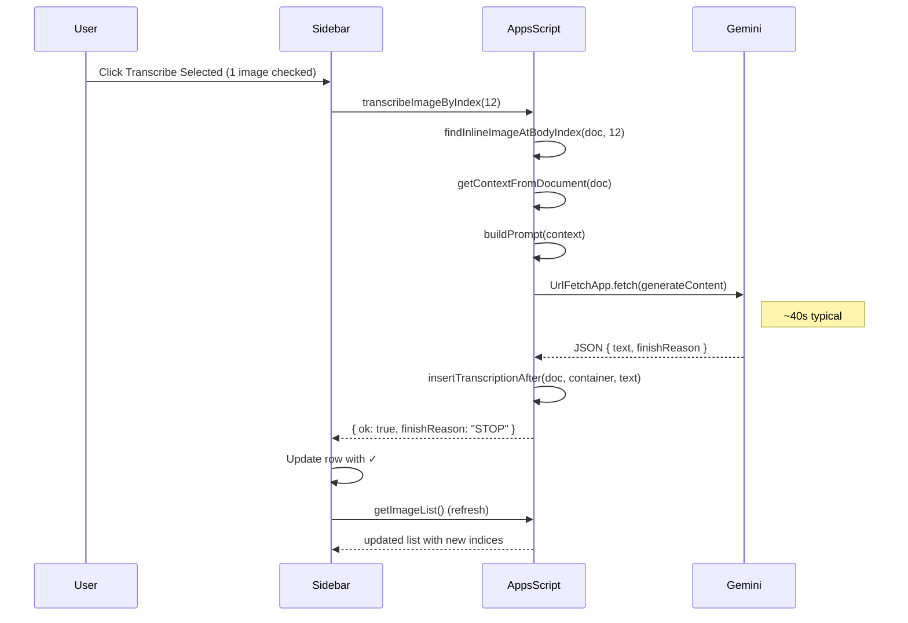
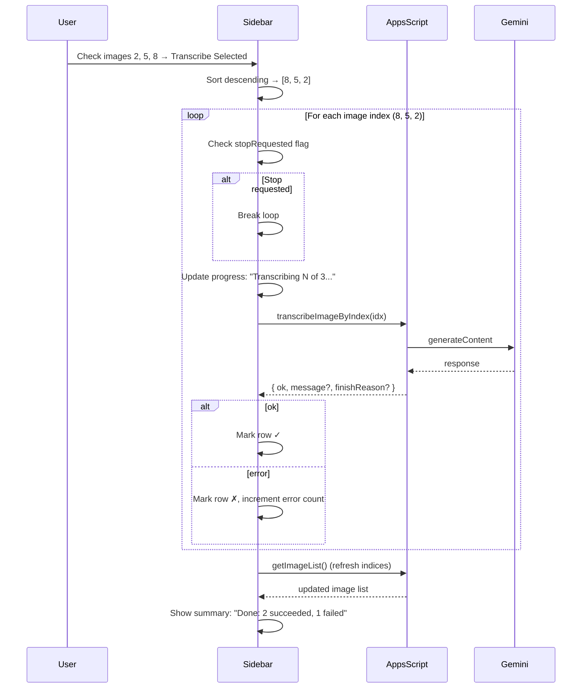

# Feature specification: Side Panel and Batch Transcribe

**Status:** Draft  
**Target version:** v0.5.0 (Unreleased)  
**Related:** `SPEC.md` (prompt/output contract), `SPEC-3-APIKEY-SETUP.md` (key dialog), `SPEC-4-PUBLISH-MARKETPLACE.md` (listing/privacy)

---

## 1. Overview and user story

**What we are building and why**

Today every transcription requires navigating Extensions → Metric Book Transcriber → Transcribe Image, selecting exactly one image, waiting ~40 s, repeating. For documents with 10–30 scanned pages this is tedious and error-prone. We are adding a **sidebar panel** that stays open while the user works, surfaces the full image list, and supports **batch transcription** of multiple images with live progress — while keeping the existing menu for discoverability and single-image use.

**User stories**

- As a genealogist, I want a persistent sidebar so I can transcribe images without navigating nested menus each time.
- As a power user with 20+ page scans, I want to select several (or all) images and batch-transcribe them with progress feedback, so I can start a batch and return when it finishes.
- As a first-time user, I want the sidebar to guide me through setup (API key) and offer the same actions as the menu, so I have one place for everything.

---

## UX: Current flows, proposed flows, sidebar IA

### Current user flows (as-is)

Today all actions live under a single top-level menu. The user must navigate the menu for every action, and transcription handles only one image per invocation.

**Menu structure (current):**

```
Extensions → Metric Book Transcriber
  ├── Transcribe Image            → transcribeSelectedImage()
  ├── Import Book from Drive Folder → importFromDriveFolder()
  ├── ─────────────────────────────
  ├── Setup API key & model       → showSetupApiKeyAndModelDialog()
  ├── Help / User Guide           → showHelp()
  └── Report an issue             → reportIssue()
```

#### Flow A — Single image transcription (current)



**Pain points:**

- 3 clicks deep to reach Transcribe Image (Extensions → submenu → item).
- Modal dialog blocks interaction — user cannot select the next image while awaiting.
- Only one image per invocation; must repeat full flow for each page.
- No visibility into which images have been transcribed.

#### Flow B — Import from Drive (current)



#### Flow C — Setup / Help / Report (current)

- **Setup API key & model:** opens modal dialog (440x320) with model dropdown + key input.
- **Help / User Guide:** opens modeless dialog with link to GitHub docs.
- **Report an issue:** opens modeless dialog with link to GitHub Issues.

---

### Proposed user flows (to-be)

#### High-level system context



#### New menu structure

```
Extensions → Metric Book Transcriber
  ├── Open Sidebar                → showTranscribeSidebar()   ← NEW
  ├── Transcribe Image            → transcribeSelectedImage() ← KEEP
  ├── Import Book from Drive Folder → importFromDriveFolder() ← KEEP
  ├── ─────────────────────────────
  ├── Setup API key & model       → showSetupApiKeyAndModelDialog()
  ├── Help / User Guide           → showHelp()
  └── Report an issue             → reportIssue()
```

**Open Sidebar** is promoted to the first menu item; it becomes the primary entry point. All existing menu items are preserved for users who prefer the current workflow.

#### Flow D — Sidebar single-image transcription (new primary path)



#### Flow E — Batch transcription (new)



**Key design decisions for batch:**

- **One `google.script.run` per image** — each call gets its own 6-min execution budget; avoids the ~6-min total limit for multi-image loops.
- **Reverse document order** for mutation safety — images processed from bottom to top so `insertTranscriptionAfter` index shifts do not affect unprocessed images above.
- **Continue on error** — a failed image is marked red; batch proceeds to the next. User sees a summary at the end.
- **Stop button** — sets a client-side flag checked between images; current image finishes, next one is skipped.

#### Sidebar state machine



---

### Side panel information architecture

The Google Docs sidebar is **300 px wide** (fixed by Google). Every control must fit that width. Layout uses vertical sections with clear visual separation.

```
┌──────────────────────────────────┐
│  Metric Book Transcriber         │  ← Title bar (set by showSidebar)
├──────────────────────────────────┤
│  ┌────────────────────────────┐  │
│  │ [Refresh ↻]  Images (12)  │  │  ← Section header + refresh button
│  ├────────────────────────────┤  │
│  │ ☑ Select All / Deselect   │  │  ← Toggle checkbox
│  │ ☐ 1. 631-12-33_0001  ✓   │  │  ← Image row: checkbox, label, status
│  │ ☑ 2. 631-12-33_0002       │  │     ✓ = already transcribed (detected)
│  │ ☑ 3. 631-12-33_0003       │  │     Label = Heading2 above image, or
│  │ ☐ 4. 631-12-33_0004  ✓   │  │     "Image N" fallback
│  │ ...                        │  │  ← Scrollable list area
│  └────────────────────────────┘  │
│                                  │
│  ┌────────────────────────────┐  │
│  │ [▶ Transcribe Selected]   │  │  ← Primary action button
│  │ [■ Stop]                  │  │  ← Visible only during batch
│  └────────────────────────────┘  │
│                                  │
│  ┌────────────────────────────┐  │
│  │  Progress: 3 / 12         │  │  ← Visible during batch
│  │  Current: 631-12-33_0005  │  │
│  │  ░░░░░░░░██████░░░░░░░░░  │  │  ← Simple progress bar
│  │  Errors: 1                │  │
│  └────────────────────────────┘  │
│                                  │
│  ┌────────────────────────────┐  │
│  │ ─── Actions ───           │  │
│  │ Import from Drive Folder  │  │  ← Calls importFromDriveFolder
│  │ Setup API key & model     │  │  ← Calls showSetupApiKeyAndModelDialog
│  └────────────────────────────┘  │
│                                  │
│  ┌────────────────────────────┐  │
│  │ Help / User Guide ↗       │  │  ← External link (window.open)
│  │ Report an issue ↗         │  │  ← External link (window.open)
│  └────────────────────────────┘  │
│                                  │
│  v0.5.0                         │  ← Version footer
└──────────────────────────────────┘
```

#### Controls and actions

| Control | Type | Action | Server function / target |
|---------|------|--------|--------------------------|
| **Refresh** | Button (icon) | Re-scan document for inline images | `google.script.run.getImageList()` |
| **Select All / Deselect** | Checkbox toggle | Check/uncheck all image rows | Client-only JS |
| **Image row checkbox** | Checkbox per row | Mark image for batch | Client-only JS |
| **Image row label** | Text (click) | Scroll doc to image (if feasible) | Future / out of scope |
| **Transcribe Selected** | Primary button | Start single or batch transcribe | `google.script.run.transcribeImageByIndex(idx)` per image |
| **Stop** | Button (danger) | Halt batch after current image finishes | Client-side flag; no server call |
| **Import from Drive Folder** | Link-button | Open import prompt (existing `ui.prompt` flow) | `google.script.run.importFromDriveFolder()` |
| **Setup API key & model** | Link-button | Open existing setup dialog | `google.script.run.showSetupApiKeyAndModelDialog()` |
| **Help / User Guide** | External link | Open GitHub User Guide in new tab | `window.open(HELP_URL)` |
| **Report an issue** | External link | Open GitHub Issues in new tab | `window.open(ISSUE_URL)` |

#### Disabled / conditional states

| Condition | UI behavior |
|-----------|-------------|
| No API key stored | Transcribe Selected disabled; sidebar shows "Set up your API key to start transcribing" message with link to Setup |
| No images in document | Image list shows "No images found. Import scans or paste images first." |
| Batch running | Transcribe Selected changes to disabled; Stop button visible; checkboxes frozen |
| Image already has transcription below it | Row shows ✓ indicator; still selectable (user may want to re-transcribe) |

---

## 2. Scope

| Change | File(s) | Notes |
|--------|---------|--------|
| New menu item: Open Sidebar | `addon/Code.gs` | `showTranscribeSidebar()` + `onOpen` update |
| Sidebar HTML | `addon/Code.gs` (inline `HtmlService`) | Per repo pattern; single function returning HTML string |
| Image scanning API | `addon/Code.gs` | `getImageList()` → returns image metadata array |
| Index-based transcribe | `addon/Code.gs` | `transcribeImageByIndex(index)` — reuses existing `callGemini`, `buildPrompt`, `insertTranscriptionAfter` |
| Transcription detection | `addon/Code.gs` | `hasTranscriptionBelow(bodyIndex)` heuristic |
| User guide update | `docs/USER_GUIDE.md` | Sidebar usage, batch flow |
| Privacy policy | `docs/PRIVACY_POLICY.md` | Confirm batch is still explicit user action |
| Store listing | `docs/STORE_LISTING.md` | Feature description update |

**Out of scope**

- Right-click context menu (not supported by Google Docs add-on API).
- Gemini File API for oversized images (future spec).
- Alternate runtime / Cloud Run.
- Scroll-to-image on row click (would require `document.setCursor` which is unreliable for images).
- Automatic re-transcription detection (only visual ✓ hint; user decides).

---

## 3. UI and frontend (Phase 3 when non-trivial)

**Entry point**

- Extensions → Metric Book Transcriber → **Open Sidebar** (first menu item).
- Sidebar also opens automatically on first install if the add-on has full auth (`onInstall`).

**Components / behavior**

- Sidebar HTML is generated inline via `HtmlService.createHtmlOutput()` in `Code.gs` (matches repo pattern: no separate `.html` files).
- Layout and controls follow the IA wireframe in the UX section above.
- Sidebar width is 300 px (Google-fixed); all controls must fit.
- CSS: clean, modern, `font-family: Arial, sans-serif`; consistent with existing dialog styling.

**Error states**

| Error | User sees |
|-------|-----------|
| No API key | Yellow banner: "Set up your API key to start transcribing" + Setup button |
| No images found | Empty state message in image list area |
| Transcription failed (single) | Red inline error below Transcribe button with message |
| Transcription failed (batch) | Red marker on failed row + error count in progress area; batch continues |
| Authorization required | Auth message matching `AUTH_REQUIRED_MSG` pattern |
| `MAX_TOKENS` (output truncated) | Warning icon on row: "Output may be truncated" |

---

## 4. Apps Script backend (Phase 4)

### Implementation plan (Phase 2 — step-by-step)

Work is split into three stages, each testable independently. All changes are in `addon/Code.gs` (inline HTML per repo pattern). No new files.

**Stage A — Menu + sidebar shell (Phase 3 deliverable)**

1. Add `showTranscribeSidebar()` that builds sidebar HTML via `HtmlService.createHtmlOutput()` and calls `DocumentApp.getUi().showSidebar()`.
2. Update `onOpen()`: insert `Open Sidebar` as first menu item before `Transcribe Image`.
3. Sidebar HTML calls `google.script.run.getImageList()` on load to populate the image list.
4. Sidebar also calls `google.script.run.hasApiKey()` on load to show/hide API key banner.

**Stage B — Server functions for sidebar (Phase 4 core)**

5. Add `hasApiKey()` — reads `UserProperties`, returns `boolean`.
6. Add `getImageList()` — traverses `body`, finds `INLINE_IMAGE` elements, returns metadata array.
7. Add `findInlineImageAtBodyIndex(doc, bodyIndex)` — given a body child index, walks the element tree to find the `INLINE_IMAGE` within it. Returns `{ inlineImage, containerElement }` or `null`.
8. Add `hasTranscriptionBelow(doc, bodyIndex)` — checks `body.getChild(bodyIndex + 1)` text for transcription markers (`Address:`, `Quality Metrics:`).
9. Add `transcribeImageByIndex(bodyIndex)` — the core new endpoint:
   - Calls `findInlineImageAtBodyIndex` to get the image blob + container
   - Calls `getContextFromDocument` → `buildPrompt` → `callGemini` (all existing, unchanged)
   - Calls `insertTranscriptionAfter` (existing, unchanged)
   - Returns `{ ok, finishReason }` or `{ ok: false, message }`
10. Modify `callGemini` to return `{ text, finishReason }` instead of raw string (minor signature change; update both callers: existing `runTranscribeWorker` and new `transcribeImageByIndex`).

**Stage C — Wiring + batch loop (Phase 4 completion)**

11. Wire sidebar "Transcribe Selected" button to call `transcribeImageByIndex` per image via `google.script.run`, with `.withSuccessHandler` / `.withFailureHandler`.
12. Client-side batch loop: sort indices descending, call sequentially, update progress DOM, check `stopRequested` flag between calls.
13. After batch completes (or stops), call `getImageList()` to refresh indices.
14. Wire remaining sidebar controls: Import (calls `importFromDriveFolder`), Setup (calls `showSetupApiKeyAndModelDialog`), Help/Report (client `window.open`).

### File changes

| File | What changes |
|------|-------------|
| `addon/Code.gs` | `onOpen` (add Open Sidebar item), new functions: `showTranscribeSidebar`, `getImageList`, `transcribeImageByIndex`, `findInlineImageAtBodyIndex`, `hasTranscriptionBelow`, `hasApiKey`. Minor update to `callGemini` return shape. Sidebar HTML string (inline). |
| `addon/appsscript.json` | **No changes** — existing scopes sufficient. |
| `addon/Prompt.gs` | **No changes**. |
| `addon/ContextTemplate.gs` | **No changes**. |
| `docs/USER_GUIDE.md` | Add sidebar + batch section (Phase 5). |
| `docs/PRIVACY_POLICY.md` | Confirm batch is explicit user action (Phase 5). |
| `docs/STORE_LISTING.md` | Update feature list if claims change (Phase 5). |

### Core logic

- **`getImageList()`** traverses `doc.getBody().getChild(i)` for all children. For each child that is a `PARAGRAPH` containing an `INLINE_IMAGE` (checked via `getNumChildren()` and child element type), it records:
  - `index`: the body-level child index (integer)
  - `label`: text of the nearest preceding `HEADING2` paragraph, or `"Image N"` fallback (1-based counter)
  - `hasTranscription`: result of `hasTranscriptionBelow`

- **`findInlineImageAtBodyIndex(doc, bodyIndex)`** gets `body.getChild(bodyIndex)`, checks if it is a `PARAGRAPH`, iterates its child elements to find one of type `INLINE_IMAGE`, returns `{ inlineImage, container }`. A paragraph typically contains [text, image] or just [image]. Returns `null` if the element at that index is not an image-containing paragraph (stale index).

- **`transcribeImageByIndex(bodyIndex)`** is the sidebar's main work function. Each invocation from the sidebar gets its own 6-minute execution budget. At ~40 s/image this is safe. The function:
  1. Validates API key
  2. Calls `findInlineImageAtBodyIndex` — returns error if `null` (stale index)
  3. Extracts blob + mimeType
  4. `getContextFromDocument(doc)` → `buildPrompt(context)` → `callGemini(apiKey, prompt, blob, mimeType)`
  5. `insertTranscriptionAfter(doc, container, transcription)`
  6. Returns `{ ok: true, finishReason }` or `{ ok: false, message }`

- **Reverse-order batch** is enforced client-side: sidebar sorts selected indices descending before calling `transcribeImageByIndex` sequentially. This ensures that inserting text after image N does not shift indices of images 1..N-1.

- **`callGemini` return shape change:** Currently returns a raw string. Changed to return `{ text: string, finishReason: string }` so the sidebar can surface `MAX_TOKENS` warnings. Existing caller `runTranscribeWorker` updated to read `.text` from the return value.

### Document mutation order diagram



### Functions and contracts (finalized)

| Exposed to client? | Function name | Args | Return | Notes |
|--------------------|---------------|------|--------|-------|
| Yes | `showTranscribeSidebar()` | none | void | Opens sidebar via `showSidebar()` |
| Yes | `getImageList()` | none | `{ ok: true, images: [{ index: number, label: string, hasTranscription: boolean }] }` | Scans full document body |
| Yes | `transcribeImageByIndex(bodyIndex)` | `number` | `{ ok: true, finishReason: string }` or `{ ok: false, message: string }` | One image per call; ~40 s |
| Yes | `hasApiKey()` | none | `boolean` | Checks `UserProperties` |
| No | `findInlineImageAtBodyIndex(doc, bodyIndex)` | `Document, number` | `{ inlineImage: InlineImage, container: Element }` or `null` | Internal helper |
| No | `hasTranscriptionBelow(doc, bodyIndex)` | `Document, number` | `boolean` | Heuristic: checks text of body child at bodyIndex+1 |
| Yes (existing) | `transcribeSelectedImage()` | none | void | Unchanged — existing menu flow |
| Yes (existing) | `runTranscribeWorker()` | none | `{ ok, message? }` | Updated: reads `.text` from `callGemini` return |
| No (existing) | `callGemini(apiKey, prompt, blob, mime)` | `string, string, Blob, string` | `{ text: string, finishReason: string }` | **Changed:** was raw string; now object |
| Yes (existing) | `importFromDriveFolder()` | none | void | Unchanged; sidebar calls via `google.script.run` |
| Yes (existing) | `showSetupApiKeyAndModelDialog()` | none | void | Unchanged |
| Yes (existing) | `saveApiKeyAndModel(key, modelId)` | `string, string` | `{ ok: true }` | Unchanged |
| Yes (existing) | `clearApiKey()` | none | `{ ok: true }` | Unchanged |
| Yes (existing) | `showHelp()` / `reportIssue()` | none | void | Unchanged; sidebar uses `window.open` instead |

### Sequence: sidebar single-image transcription



### Sequence: sidebar batch transcription



### OAuth / manifest

- New or changed scopes: **No** — existing scopes in `appsscript.json` cover all functionality:
  - `documents.currentonly` for body traversal and insertion
  - `drive.readonly` for import
  - `script.external_request` for Gemini API calls
  - `script.container.ui` for sidebar, menus, dialogs

---

## 5. Edge cases

- **Empty document (no images):** `getImageList` returns empty array; sidebar shows "No images found" message.
- **No Context section:** `getContextFromDocument` returns `''`; prompt uses `'(No context provided.)'` fallback (existing behavior).
- **No API key:** Sidebar detects via `hasApiKey()`; disables Transcribe button; shows setup prompt.
- **Image too large for inline Gemini request (>~15 MB base64):** `callGemini` may fail with payload error; surfaced as error on that row; batch continues.
- **`MAX_TOKENS` truncation:** `finishReason: "MAX_TOKENS"` returned; sidebar shows warning indicator on row.
- **Batch with 30 images:** At ~40 s/image, total wall time ~20 min. Each image is its own `google.script.run` (own 6-min budget). User can stop anytime.
- **Concurrent sidebar + menu transcribe:** User could run Transcribe Image from menu while sidebar batch runs; both would try to insert into the doc. Not actively prevented but documented as "use one path at a time."
- **Index stale between operations:** After each `transcribeImageByIndex`, indices shift. Client processes in reverse order so unprocessed image indices remain stable. After batch completion, `getImageList()` refresh re-scans and returns fresh indices.
- **User closes sidebar mid-batch:** Client-side JS stops; current server call completes and inserts; remaining images are skipped. Not an error.
- **API rate limit (429):** Gemini returns HTTP 429; `callGemini` throws; surfaced as error on that row; batch continues (next image may also hit 429).
- **UrlFetch 60s timeout:** Single image that takes >60s fails; error shown on row; batch continues.

---

## 6. Acceptance criteria (Phase 5)

- [ ] **Open Sidebar** menu item opens sidebar; sidebar stays open while user interacts with doc.
- [ ] Sidebar image list matches inline images in document body, in document order, with correct labels.
- [ ] **Refresh** button re-scans and updates image list (picks up newly added or deleted images).
- [ ] **Select All** / **Deselect** toggles all checkboxes.
- [ ] Single-image transcribe from sidebar produces identical output to existing menu-based Transcribe Image.
- [ ] Batch transcribe processes images in **reverse document order**; transcriptions inserted under correct images.
- [ ] Batch progress updates live (counter, current image label).
- [ ] **Stop** button halts batch after current image completes; shows partial summary.
- [ ] Errors on individual images do not stop the batch; failed rows marked; summary shows counts.
- [ ] `MAX_TOKENS` warning surfaced on affected rows.
- [ ] No API key → Transcribe disabled; setup prompt shown.
- [ ] No images → empty state message.
- [ ] Existing menu Transcribe Image / Import / Setup / Help / Report unchanged and functional.
- [ ] `google.script.run` wiring uses `.withSuccessHandler` / `.withFailureHandler` on every call.
- [ ] `appsscript.json` scopes unchanged.
- [ ] No secrets or API keys in source.
- [ ] `docs/USER_GUIDE.md` updated with sidebar and batch instructions.
- [ ] `docs/PRIVACY_POLICY.md` confirms batch is explicit user action.
- [ ] `docs/STORE_LISTING.md` updated if feature claims change.

---

## 7. Manual / Google-side steps (if any)

- **Marketplace:** If the store listing description changes, update via Google Workspace Marketplace SDK in GCP Console.
- **No new OAuth scopes** → no re-verification needed.
- After push: `clasp push` to deploy to Apps Script project; create new test deployment or version as needed.

---

## Platform limits reference

| Limit | Value | Impact |
|-------|-------|--------|
| Apps Script execution time | 6 min / invocation | Each `transcribeImageByIndex` call is its own invocation (called from sidebar JS); safe at ~40 s/image |
| `UrlFetchApp` timeout | 60 s (hardcoded) | Per-Gemini-call ceiling; `fetchTimeoutSeconds: 60` in `callGemini` |
| `UrlFetchApp` POST size | 50 MB | Well above typical scan + prompt |
| Gemini inline request | ~20 MB total (image + prompt + base64 overhead) | Large scans may need downsizing; out of scope for this spec |
| Gemini `maxOutputTokens` | 8192 (configured) | Dense pages may truncate; `finishReason: MAX_TOKENS` |
| `UrlFetchApp` daily calls | 20,000 (consumer) / 100,000 (Workspace) | Batch of 30 images = 30 calls; negligible |
| `PropertiesService` value size | 9 KB | Only used for API key + model ID; fine |
| Sidebar width | 300 px (Google-fixed) | All controls must fit; no horizontal scroll |
| Google Docs character limit | ~1 million characters | 30 transcriptions of ~2 KB each = ~60 KB; far from limit |
| `onOpen` / simple triggers | 30 s | Menu creation only; no heavy work |
