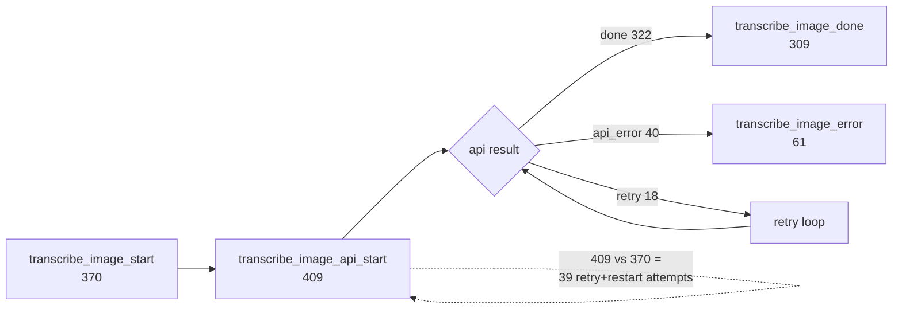
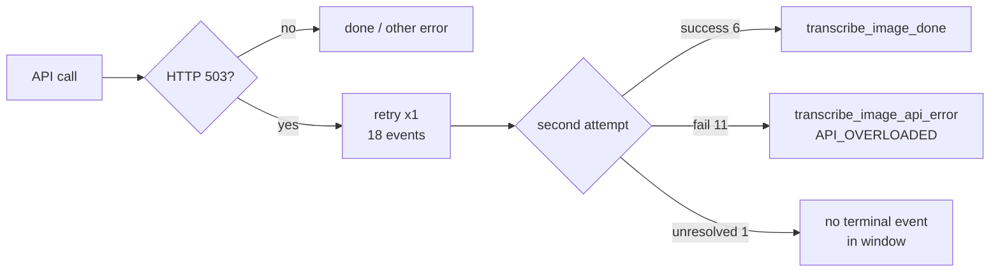

# Weekly Operations Report — 2026-04-25 → 2026-05-02

## 1. Executive Summary

| Metric | Value |
|---|---|
| Window | 2026-04-25 → 2026-05-02 (7 days) |
| Unique users | 13 |
| Total OBS events | 2163 |
| Transcriptions started / succeeded / failed | 370 / 309 / 61 |
| Transcription success rate | **83.5 %** |
| Platform (non-OBS) errors | 10 |
| Estimated Gemini spend | **$6.03 USD** |

**Takeaways**

1. Transcription volume is healthy (309 successful runs, 13 users). One power user (`sha256:e11732fb…`) drives ~87 % of the throughput.
2. **API_RATE_LIMIT (Gemini 429) is the single biggest failure mode** — 41 of 61 transcribe errors and 2 context-extract errors, across 4 distinct users. Users on the Gemini free tier hit quota mid-session and keep retrying.
3. **One user is stuck with an invalid API key** (`sha256:3eeaf2d4…`) — 9 retries across context + transcribe with HTTP 400 `API key not valid`. No pre-flight validation means the wrong key is saved and fails silently until an actual transcribe is attempted.
4. **One user is missing the `script.external_request` OAuth grant** (`sha256:fefebbbc…`) — 6 transcribe failures plus 10 `picker_config_scope_error` events, all the same underlying `UrlFetchApp.fetch` permission exception. Likely an install that predates the scope addition or a partial re-auth.
5. **503 retry effectiveness is poor** — 18 retries triggered (all HTTP 503 / API_OVERLOADED), only 6 eventually succeeded (33 %). The current single-shot retry does not absorb sustained demand spikes.

**Week-over-week trend**

No prior reports — this is the first weekly report. Baselines established here.

| Metric | This week | Prior | Trend |
|---|---|---|---|
| Transcription success rate | 83.5 % | n/a | → (baseline) |
| API_RATE_LIMIT count | 41 | n/a | → (baseline) |
| Platform errors | 10 | n/a | → (baseline) |
| p95 latency (ms) | 227 962 | n/a | → (baseline) |
| Estimated cost (USD) | $6.03 | n/a | → (baseline) |

## 2. Carryover from Previous Reports

No findings — first weekly report, no prior fixes to verify.

## 3. Transcription Error Breakdown

| Error code | Count | Unique users | Notes |
|---|---|---|---|
| `API_RATE_LIMIT` (429) | 41 | 4 | Gemini free-tier quota exceeded |
| `API_OVERLOADED` (503) | 9 | 5 | Model capacity; 6 more absorbed by retry |
| `UNKNOWN` | 6 | 1 | All from one user missing `script.external_request` grant |
| `API_HTTP_ERROR` (400) | 4 | 1 | All from one user with an invalid API key |
| `DOC_SELECTION_INVALID` | 1 | 1 | User ran transcribe without a selected image |

*Transcription funnel for the week. 370 user-initiated runs triggered 409 API calls (the delta is retries and resumes); 322 API calls completed and 309 landed in the doc; 61 runs surfaced a user-visible error.*

The 322 vs 309 gap (13 API successes that did not become `transcribe_image_done`) is worth noting — a successful API response but no completion event suggests post-API failures (doc insertion, rendering) or abandoned runs.

## 4. Non-OBS Platform Errors

| Category | Count | First seen | Last seen | Severity |
|---|---|---|---|---|
| `oauth_permission` | 7 | 2026-04-25 21:37 | 2026-04-26 20:19 | ERROR |
| `execution_timeout` | 2 | 2026-04-25 05:10 | 2026-04-25 05:20 | ERROR |
| `other` | 1 | 2026-04-27 10:20 | 2026-04-27 10:20 | ERROR |

All 7 `oauth_permission` events are `Ui.showModalDialog`, `Ui.showSidebar`, or `DocumentApp.getActiveDocument` permission failures — user consent lapsed or the add-on was invoked outside a document context. Both `execution_timeout` events happened within a 10-minute window early on 2026-04-25 and represent runs that hit the Apps Script 6-minute script-runtime ceiling. We do not currently emit an OBS event when Apps Script kills a run, so we cannot tell whether these were import or transcribe runs.

## 5. Retry & Recovery Effectiveness

| | Count |
|---|---|
| Retries triggered (all 503) | 18 |
| Retries that eventually succeeded | 6 |
| Retries that still failed | 11 |
| Unique runs that hit a retry | 18 |
| 503 retry success rate | **33 %** |

*503 retry path — one retry per run, 33 % eventual success.*

Only one retry is attempted per run today. Given that 11 of 18 retries still failed, a second retry with jitter would likely salvage additional runs during a brief spike.

## 6. Per-User Failure Rates

| User key (prefix) | Successes | Failures | Fail rate |
|---|---:|---:|---:|
| `sha256:e11732fb…` | 271 | 33 | 10.9 % |
| `sha256:4927dcf2…` | 0 | 8 | **100 %** |
| `sha256:fefebbbc…` | 0 | 6 | **100 %** |
| `sha256:3eeaf2d4…` | 9 | 4 | 30.8 % |
| `sha256:50d29bff…` | 11 | 3 | 21.4 % |
| `sha256:9a57a5b5…` | 0 | 3 | **100 %** |
| `sha256:1dbc25d5…` | 3 | 2 | 40.0 % |
| `sha256:7793c2bd…` | 6 | 2 | 25.0 % |
| `sha256:404de7f6…` | 2 | 0 | 0 % |
| `sha256:68f0b365…` | 2 | 0 | 0 % |

Three users at 100 % fail rate:

- `sha256:4927dcf2…` — 7× `API_RATE_LIMIT` + 1× `API_OVERLOADED`. Exhausted Gemini quota and gave up.
- `sha256:fefebbbc…` — 6× `UNKNOWN`, all the `UrlFetchApp.fetch` scope-permission exception. Stale OAuth grant.
- `sha256:9a57a5b5…` — 2× `API_RATE_LIMIT` + 1× `DOC_SELECTION_INVALID`. Quota-limited and at least once ran transcribe with no image selected.

## 7. Import Pipeline Health

| | Value |
|---|---|
| Imports started | 37 |
| Imports completed | 35 |
| Completion rate | 94.6 % |
| Total images added | 365 |
| Skipped files (non-image) | 130 |
| Runs that hit `MAX_IMPORT_IMAGES=30` ceiling | 4 |
| p50 / max import latency | 22 s / 414 s |

Two imports started but produced no `import_drive_done` — likely the two `execution_timeout` platform errors or user aborts. Four imports hit the 30-image cap and truncated; one user repeatedly runs batches of 50 images.

## 8. Latency & Cost

| Metric | Value |
|---|---|
| Transcribe latency samples | 309 |
| p50 | 63.3 s |
| p95 | 228.0 s |
| p99 | 288.7 s |
| Prompt tokens | 910 804 |
| Output tokens | 699 139 |
| Total tokens (incl. thinking) | 5 127 262 |
| Estimated Gemini cost | **$6.03 USD** |

p50 at 63 s is noteworthy — every median transcribe takes more than a minute. p99 at 289 s approaches half the Apps Script 6-minute hard ceiling; a single overloaded retry on a long run could push it over.

## 9. Spotlights

- **One user retried an invalid API key 9 times over the week.** `sha256:3eeaf2d4…` saved a key that returns HTTP 400 `API key not valid`. Every context extraction and transcribe attempt fails the same way. The setup dialog accepted the key without validation, so the user has no in-product signal that the key itself is the problem. Nine failures → zero corrections.
- **One user is blocked by a permission grant that no longer covers `UrlFetchApp.fetch`.** `sha256:fefebbbc…` produces the scope exception on every transcribe (6×) and also on picker configuration (10×) — 16 distinct failure events. The add-on silently surfaces the raw Apps Script exception; there is no "please reauthorize" guidance.
- **Gemini quota exhaustion has a long tail.** One user (`sha256:e11732fb…`) accounts for 31 of 41 `API_RATE_LIMIT` events and still has an 89 % success rate — they keep pushing past their quota, succeed when it resets, and absorb the failures. The other three rate-limited users have 0 % success.
- **The context-extract → apply funnel loses more than half its runs.** 22 extract starts → 13 successful extractions → only 4 applied to a doc. The 9-run gap between extract-done and extract-apply is larger than the error count — it suggests users cancelling the preview dialog or hitting a UI path that does not emit `context_apply_done`.

## 10. Proposed Fixes

| # | Fix | Root cause | Expected impact | Size | Auto-executable? |
|---|---|---|---|---|---|
| 1 | Validate Gemini API key on save in setup dialog by making a minimal test call; reject save on HTTP 400/401/403. | Invalid key is persisted silently; surfaces only on first transcribe. | Eliminates ~4 `API_HTTP_ERROR` transcribe failures per week; prevents future duplicates. | small | yes |
| 2 | Detect `UrlFetchApp.fetch` / scope permission error in error handler and surface an actionable message ("Please reauthorize via Extensions → Add-ons → Manage") instead of raw exception. | Stale OAuth grant shows a cryptic Apps Script error; user does not know what to do. | Unblocks users like `sha256:fefebbbc…`; reduces repeat scope errors. | small | yes |
| 3 | Improve `API_RATE_LIMIT` error UX — detect 429 and show a dedicated message pointing to the Gemini billing/quota page, with a "try again in N minutes" hint instead of the raw JSON. | Users do not realise they hit a quota vs a transient error. | Reduces retry churn from rate-limited users; clearer path to resolution. | small | yes |
| 4 | Add a second retry attempt with jitter for HTTP 503 `API_OVERLOADED`. Cap at 2 retries total, exponential backoff (1 s, 3 s + jitter). | Single retry absorbs only 33 % of 503s; a brief spike often extends past one retry window. | Could salvage ~5 additional runs per week; keeps p95 bounded because runs fail fast on persistent outages. | small | yes |
| 5 | Emit an OBS event when the context-apply dialog is cancelled (distinct from error or success), so the extract→apply drop-off can be attributed to cancel vs silent failure. | Currently 9 "extracted but never applied" runs are indistinguishable — cannot tell UX issue from bug. | Unlocks follow-up triage in next week's report. | small | yes |
| 6 | Add a lightweight "run started / run ended" OBS event pair at the top of `transcribeSelectedImage` / `importFromDriveFolder` so `execution_timeout` kills can be attributed to an operation. | Today a timeout produces only a platform log with no OBS correlation. | Lets us identify which path hits the 6-minute ceiling. | small | yes |
| 7 | Per-user quota back-off: after N consecutive `API_RATE_LIMIT` errors for one user within 5 minutes, disable the transcribe button client-side for a cooldown window. | Users keep hammering a rate-limited key and generate noise. | Reduces 429 churn; better UX for quota-bound users. | medium | no — needs SDD |
| 8 | Investigate and fix the picker config scope flow that emits `picker_config_scope_error` repeatedly for one user — determine whether it is the same root cause as fix #2 or a separate code path. | 10 events over 7 days, all from one user, same `UrlFetchApp.fetch` permission message. | Closes the largest single-event cluster. | medium | no — needs SDD |

## 11. Open Questions

- Is the 322-vs-309 gap in the transcribe funnel (13 API successes without a `transcribe_image_done`) due to doc-insertion failures, user cancels, or missing instrumentation?
- The two `execution_timeout` platform errors cluster in a 10-minute window on 2026-04-25. Was this a single user hitting Apps Script's script-runtime limit on a long import/transcribe, or two separate incidents?
- Should the add-on proactively warn when Gemini latency p95 sits above ~4 minutes, given the Apps Script 6-minute ceiling?

## 12. Data Provenance

- Summary: `project/operations/weeklyreports/data/2026-05-02-summary.json`
- Window: 2026-04-25 → 2026-05-02
- Fetch command: `observability/scripts/fetch-weekly-logs.sh` (default window: last 7 days ending today UTC)
